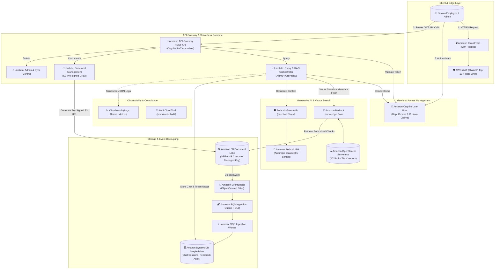

# EnterpriseIQ: Secure Enterprise Generative AI Knowledge & Support Platform on AWS

[](https://aws.amazon.com/)
[]()
[]()
[-purple.svg)]()
[]()

> **Production-grade, multi-tenant Enterprise Knowledge Retrieval & Decision Support Platform built on AWS using Amazon Bedrock, Bedrock Knowledge Bases, S3 SSE-KMS, Serverless Lambda, Amazon Cognito, and DynamoDB.**

---

## 📑 Table of Contents
- [1. Executive Summary & Business Problem](#1-executive-summary--business-problem)
- [2. Cloud Architecture Topology](#2-cloud-architecture-topology)
- [3. Key Architectural Innovations](#3-key-architectural-innovations)
- [4. Multi-Department RBAC & Zero-Trust Security](#4-multi-department-rbac--zero-trust-security)
- [5. RAG Retrieval & Anti-Hallucination Pipeline](#5-rag-retrieval--anti-hallucination-pipeline)
- [6. Asynchronous Event-Driven Ingestion Pipeline](#6-asynchronous-event-driven-ingestion-pipeline)
- [7. Project Directory Structure](#7-project-directory-structure)
- [8. Local Quickstart & Testing](#8-local-quickstart--testing)
- [9. AWS CloudFormation Deployment](#9-aws-cloudformation-deployment)
- [10. Cost Optimization & Personal Account Safety](#10-cost-optimization--personal-account-safety)
- [11. Interview Preparation & Documentation Artifacts](#11-interview-preparation--documentation-artifacts)

---

## 1. Executive Summary & Business Problem

**Client Context:** *Nexora Technologies Pvt Ltd* (~1,200 employees across Human Resources, Engineering, Finance, IT Support, Operations, and Management).

### The Challenge
- **Knowledge Silos:** Internal runbooks, policies, and SOPs were scattered across static PDFs, SharePoint, and local drives.
- **Support Overhead:** HR, IT Helpdesk, and Finance teams spent 35% of their working hours answering repetitive questions.
- **Compliance & Privacy Risk:** High risk of accidental disclosure of confidential payroll or executive data when using standard, non-permissioned internal search.

### The Solution: EnterpriseIQ
EnterpriseIQ provides an **AI Knowledge Assistant** grounded strictly in verified corporate documentation with:
1. **Pre-Retrieval RBAC Filtering:** Prevents unauthorized document chunks from entering the LLM prompt context.
2. **Deterministic Citations:** Answers display exact S3 object paths, page numbers, and vector confidence scores.
3. **Defense-in-Depth AI Security:** Prompt-injection shields and automated PII masking.
4. **Serverless Micro-Handlers:** High availability with zero idle compute costs on AWS Graviton2 (ARM64).

---

## 2. Cloud Architecture Topology



---

## 3. Key Architectural Innovations

| Architectural Dimension | Naive Chatbot Implementation | EnterpriseIQ Production Design |
| :--- | :--- | :--- |
| **Authorization** | Post-filtering or relying on the LLM to refuse answers | **Pre-retrieval vector metadata filtering** at the OpenSearch / Knowledge Base layer. |
| **Compute Architecture** | Single monolithic backend server or EC2 instance | **Modular serverless Lambda micro-handlers** on AWS Graviton2 (ARM64) with sub-second billing. |
| **Storage & Encryption** | Unencrypted public S3 buckets | **S3 Block Public Access + SSE-KMS Customer Managed Key (CMK)** with annual key rotation. |
| **Ingestion Pipeline** | Synchronous blocking file uploads | **Asynchronous EventBridge $\rightarrow$ SQS $\rightarrow$ Lambda Worker with Dead-Letter Queue (DLQ)**. |
| **AI Security** | Vulnerable to prompt injections | **Dual-Layer Defense:** Bedrock Guardrails + System Prompt XML Context Isolation. |

---

## 4. Multi-Department RBAC & Zero-Trust Security

### Department Clearance Matrix

```
┌─────────────────┬───────────────────┬──────────────────────────────────┬─────────────────────────────┐
│ Role / Group    │ Department Claim  │ Allowed Knowledge Base Query     │ Admin Operations Allowed    │
├─────────────────┼───────────────────┼──────────────────────────────────┼─────────────────────────────┤
│ Engineering Emp │ Engineering       │ Engineering + Public Internal    │ None (Read-only chat)       │
│ HR Employee     │ HR                │ HR Policies + Public Internal    │ None (Read-only chat)       │
│ Finance Emp     │ Finance           │ Finance + Public Internal        │ None (Read-only chat)       │
│ IT Support Emp  │ IT Support        │ IT Runbooks + Public Internal    │ None (Read-only chat)       │
│ Operations Emp  │ Operations        │ SOPs + Public Internal           │ None (Read-only chat)       │
│ Executive/Mgmt  │ Management        │ All Departments + Restricted     │ View Analytics              │
│ Global Admin    │ All Departments   │ All Departments + Audit Logs     │ Full (Upload, Delete, Sync) │
└─────────────────┴───────────────────┴──────────────────────────────────┴─────────────────────────────┘
```

---

## 5. RAG Retrieval & Anti-Hallucination Pipeline

Every document stored in S3 is accompanied by a standardized Bedrock sidecar file (`<filename>.metadata.json`):

```json
{
  "metadataAttributes": {
    "department": "Engineering",
    "classification": "DEPARTMENT_ONLY",
    "documentId": "NEX-ENG-ARC-001",
    "title": "Nexora Cloud Production Deployment Runbook",
    "version": "4.5"
  }
}
```

### Pre-Retrieval Filter Constructed by Lambda:
```python
retrieval_filter = {
    "orAll": [
        {"equals": {"key": "department", "value": user_claims.department}},
        {"equals": {"key": "classification", "value": "PUBLIC_INTERNAL"}}
    ]
}
```

---

## 6. Project Directory Structure

```
EnterpriseIQ-AWS/
├── frontend/                     # React + Vite + TypeScript Enterprise SPA
│   ├── src/
│   │   ├── components/           # CitationDrawer, PersonaSwitcher, Navbar, Modals
│   │   ├── pages/                # ChatAssistant, Dashboard, Documents, Admin, Audit
│   │   ├── services/apiService.ts# Unified API client & RAG simulator
│   │   └── types/index.ts        # TypeScript domain models
├── backend/                      # Serverless Lambda Backend & GenAI Engine
│   ├── config/aws_config.py      # Bedrock model IDs, DynamoDB table, KMS settings
│   ├── handlers/                 # Modular Lambda Handlers (Query, Docs, Admin, Ingestion)
│   ├── models/domain_models.py   # Python domain data classes
│   ├── services/                 # Bedrock, RAG Retriever, Guardrails, DynamoDB services
│   └── tests/                    # Automated unit & integration test suites
├── documents/                    # 11 Realistic Enterprise Policies + Bedrock Sidecars
│   ├── engineering/
│   ├── finance/
│   ├── hr/
│   ├── itsupport/
│   ├── management/
│   └── operations/
├── infrastructure/               # AWS CloudFormation Infrastructure-as-Code (IaC)
│   ├── s3-document-vault.yaml
│   ├── cognito-user-pool.yaml
│   ├── serverless-backend.yaml
│   ├── dynamodb-state-store.yaml
│   ├── async-eventbridge-sqs-pipeline.yaml
│   ├── cloudwatch-observability.yaml
│   └── waf-security-rules.yaml
├── scripts/                      # Automation & S3 Sync Scripts
│   ├── sync_documents_s3.py
│   └── seed_documents.py
└── docs/                         # Master Interview Guides & Architecture Playbooks
    ├── INTERVIEW_QA_MASTER.md
    ├── SCENARIO_BASED_TROUBLESHOOTING.md
    ├── RESUME_PROJECT_ENTRY.md
    └── COST_AND_TEARDOWN_PLAYBOOK.md
```

---

## 7. Enterprise Operations & Workplace Expansion Modules

EnterpriseIQ extends beyond standard RAG into a complete **Enterprise Workplace Management & Governance Suite**:

| Module | Purpose | AWS & Architecture Components |
|---|---|---|
| **🤖 Bedrock Action Groups & Tools** | Natural language workplace action execution (PTO leave, tickets, expenses, IAM access) directly in chat with confirmation receipt cards | Amazon Bedrock Agent Action Groups, EventBridge, DynamoDB Single-Table |
| **🎙️ Polly & Transcribe Voice Mode** | Hands-free audio dictation and neural voice synthesis for workplace queries | Amazon Transcribe Live Streaming, Amazon Polly Neural Voices |
| **🏖️ HR PTO & Leave Portal** | Accrual ledger, multi-type time-off requests, and VP manager approval workflows | DynamoDB HRMS Partition, SQS Async Email Alerts |
| **🔐 IT Asset & IAM Access** | Hardware serial tracking, just-in-time temporary AWS IAM role provisioning (Bastion, EKS) | AWS IAM Role Delegation, Cognito Custom Scopes |
| **💳 Finance Expense Claims** | Per-diem limit enforcement (₹2,500 domestic metro, ₹50,000 WFH setup), GST invoice verification, and VP approval routing | S3 Receipt Vault, Concur API Gateway integration |
| **📢 Corporate Compliance & Acks** | Mandatory company policies with cryptographic employee acknowledgment logging | SHA-256 Audit Records, DynamoDB Policy Ledger |
| **🛡️ S3 Quarantine Staging Vault** | Dual-bucket staging isolation preventing unreviewed docs from entering production vector index | S3 Bucket Replication, EventBridge Event Filtering |
| **🎫 IT Helpdesk SLA Center** | AI escalation with grounding context, priority routing (P1-P4), and SLA timers | DynamoDB GSI Indexing, ServiceNow/Jira Webhook Bridge |
| **📊 Knowledge Gaps & RAG Triad** | Automated ungrounded query clustering, hallucination scoring, and FinOps token attribution | Bedrock CloudWatch Metrics, Titan Embedding Clustering |
| **📜 SOC 2 Compliance Dossier** | 1-Click cryptographic audit dossier export (.json) covering CC6.1, CC6.6, CC6.7, CC7.2 | CloudTrail Immutable Chain, SHA-256 Merkle Verification |
| **📈 Live CloudWatch Telemetry** | Real-time P50/P95/P99 latency gauge, WCU/RCU consumption, and live CloudWatch Log Stream viewer | CloudWatch Alarms & Metric Filters |

---

## 8. Enterprise Engineering Practices & Operational Governance

EnterpriseIQ satisfies tier-1 corporate production standards across 7 core engineering pillars:

```
┌──────────────────────────────────────┬────────────────────────────────────────────────────────────────────────┐
│ Engineering Pillar                   │ Implementation & Codebase Artifacts                                    │
├──────────────────────────────────────┼────────────────────────────────────────────────────────────────────────┤
│ 1. Dual IaC Framework                │ • Modular CloudFormation (7 templates in infrastructure/)               │
│                                      │ • Terraform HCL Stacks (infrastructure/terraform/)                     │
├──────────────────────────────────────┼────────────────────────────────────────────────────────────────────────┤
│ 2. CI/CD Automation                  │ • GitHub Actions CI: backend/frontend tests & Bandit SAST (.github/)   │
│                                      │ • Multi-stage Continuous Deployment: dev, staging, prod workflows     │
├──────────────────────────────────────┼────────────────────────────────────────────────────────────────────────┤
│ 3. Environment Separation            │ • Parameterized configs: infrastructure/params/{dev,staging,prod}.json │
│                                      │ • .env.example, .env.development, .env.production templates            │
├──────────────────────────────────────┼────────────────────────────────────────────────────────────────────────┤
│ 4. Disaster Recovery (DR)            │ • SLA Target: RTO <= 15 min, RPO <= 5 min (documents/operations/dr/)   │
│                                      │ • Automated DR verification drill: scripts/dr_restore_drill.py         │
│                                      │ • Multi-region S3 CRR & Route 53 ARC template (disaster-recovery.yaml) │
├──────────────────────────────────────┼────────────────────────────────────────────────────────────────────────┤
│ 5. Secrets & Parameter Mgmt          │ • AWS Secrets Manager & SSM Parameter Store with in-memory TTL caching │
│                                      │ • Transparent fallback in backend/services/secrets_service.py          │
├──────────────────────────────────────┼────────────────────────────────────────────────────────────────────────┤
│ 6. Security Testing & SAST           │ • 26 Unit & Integration Tests (100% passing in < 1.5s)                 │
│                                      │ • Automated zero-credentials & least-privilege scanner (security_scan) │
├──────────────────────────────────────┼────────────────────────────────────────────────────────────────────────┤
│ 7. Operational Incident Runbooks     │ • 10 Outage scenarios in docs/SCENARIO_BASED_TROUBLESHOOTING.md        │
│                                      │ • 1-Click Rollback & Incident command in OPERATIONAL_INCIDENT_RUNBOOKS │
└──────────────────────────────────────┴────────────────────────────────────────────────────────────────────────┘
```

---

## 9. Local Quickstart & Testing

### 1. Run the Frontend Enterprise Portal
```bash
cd frontend
npm install
npm run dev
# Open http://localhost:5173/ in your browser
```

### 2. Run the Full Backend, Security & DR Test Suite (26 Tests)
```bash
python -m unittest discover -s backend/tests -v
# 26 passing tests covering RAG, RBAC, Secrets Manager, DR SLAs, and Security
```

### 3. Run Automated Security & Secrets Code Scanner
```bash
python scripts/security_scan.py
```

### 4. Run Disaster Recovery Verification Drill
```bash
python scripts/dr_restore_drill.py
```

---

## 10. Master Documentation & Enterprise Specifications

- **[Master System Study Guide (Full Architecture In-and-Out)](file:///c:/Users/Gauth/OneDrive/Desktop/EnterpriseIQ-AWS/docs/ENTERPRISEIQ_COMPLETE_SYSTEM_STUDY_GUIDE.md)**
- **[Operational Incident Runbooks & 1-Click Rollback Playbook](file:///c:/Users/Gauth/OneDrive/Desktop/EnterpriseIQ-AWS/docs/OPERATIONAL_INCIDENT_RUNBOOKS_AND_ROLLBACK.md)**
- **[26-Module Architecture & Technical Deep-Dive Guide](file:///c:/Users/Gauth/OneDrive/Desktop/EnterpriseIQ-AWS/docs/MODULE_WISE_ARCHITECTURE_DEEP_DIVE.md)**
- **[Enterprise Commercial Proposal & AWS Deployment Blueprint](file:///c:/Users/Gauth/OneDrive/Desktop/EnterpriseIQ-AWS/docs/ENTERPRISE_SALES_AND_DEPLOYMENT_PROPOSAL.md)**
- **[Master Enterprise SRS Specification (IEEE 830 / ISO 29148)](file:///c:/Users/Gauth/OneDrive/Desktop/EnterpriseIQ-AWS/docs/ENTERPRISE_SRS_SPECIFICATION.md)**
- **[Master 40+ Technical Interview Q&A](file:///c:/Users/Gauth/OneDrive/Desktop/EnterpriseIQ-AWS/docs/INTERVIEW_QA_MASTER.md)**
- **[10 Scenario-Based Troubleshooting Defense Modules](file:///c:/Users/Gauth/OneDrive/Desktop/EnterpriseIQ-AWS/docs/SCENARIO_BASED_TROUBLESHOOTING.md)**
- **[ATS-Optimized Resume Project Entry](file:///c:/Users/Gauth/OneDrive/Desktop/EnterpriseIQ-AWS/docs/RESUME_PROJECT_ENTRY.md)**
- **[AWS Cost Controls & Teardown Playbook](file:///c:/Users/Gauth/OneDrive/Desktop/EnterpriseIQ-AWS/docs/COST_AND_TEARDOWN_PLAYBOOK.md)**

---

## 11. License & Authorship
Developed as a production-grade AWS Cloud Engineering & Generative AI Platform by **Nexora Technologies Solutions Architecture Team**. Released under the MIT License.

