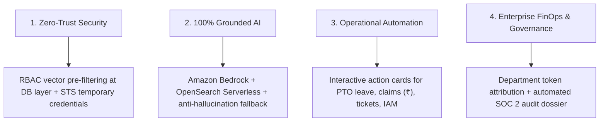
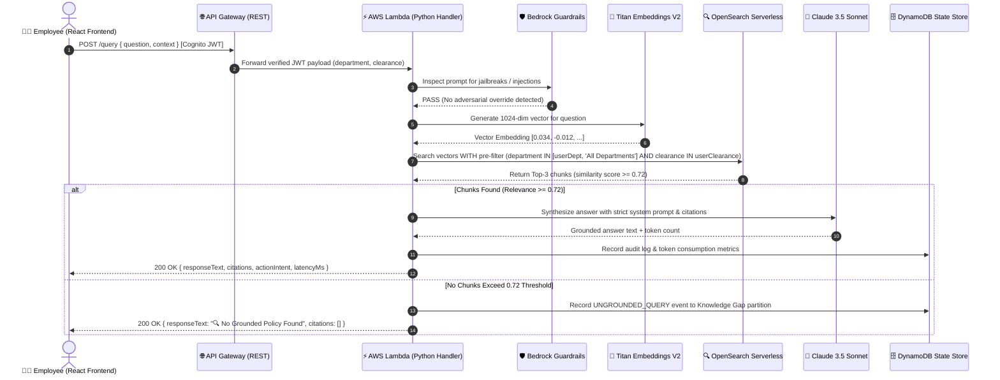
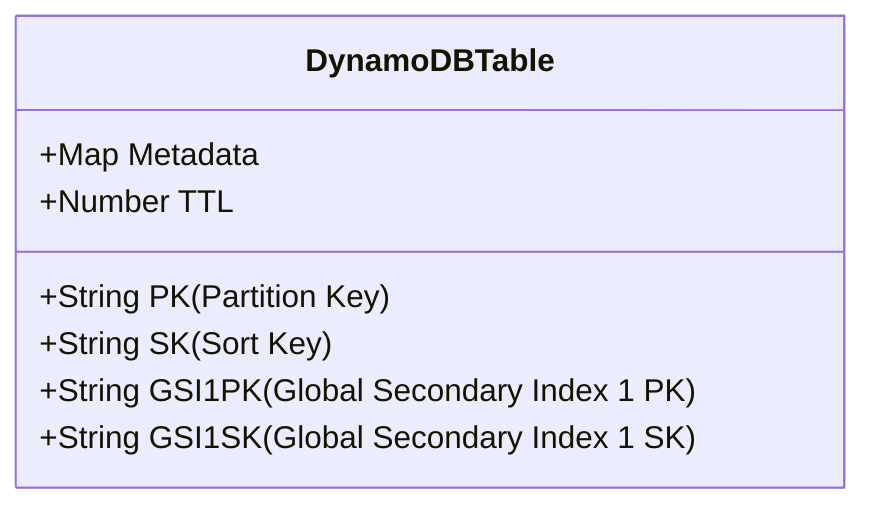
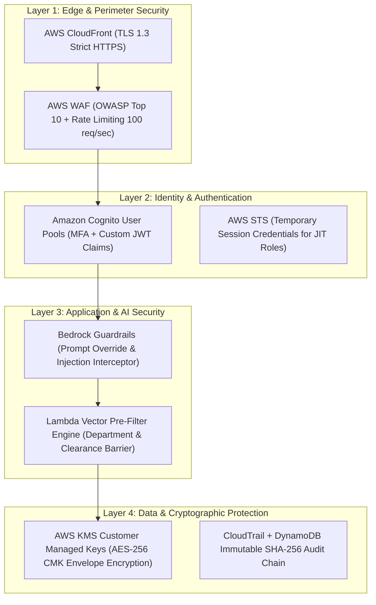
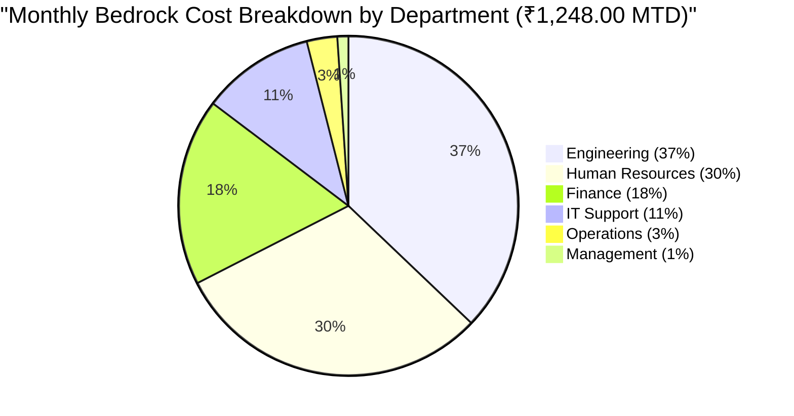

# EnterpriseIQ — Complete System Study & Architectural Master Guide
**Platform:** EnterpriseIQ (AWS-Native Enterprise Knowledge & Workplace Management System)  
**Organization Profile:** Nexora Technologies India Pvt. Ltd. (2,000+ Employees across Bengaluru, Hyderabad, Mumbai, Pune, Chennai, Gurugram)  
**Cloud Infrastructure:** AWS Serverless, Amazon Bedrock, OpenSearch Serverless, DynamoDB (`ap-south-1` Mumbai)  
**Primary Currency:** Indian Rupees (`₹` / `INR`)  

---

## 📖 Table of Contents
1. [System Overview & Architectural Philosophy](#1-system-overview--architectural-philosophy)
2. [End-to-End Request & Data Flow Lifecycle](#2-end-to-end-request--data-flow-lifecycle)
3. [Deep-Dive: Amazon Bedrock RAG & Vector Retrieval Engine](#3-deep-dive-amazon-bedrock-rag--vector-retrieval-engine)
4. [DynamoDB Single-Table Schema & Access Patterns](#4-dynamodb-single-table-schema--access-patterns)
5. [Enterprise Security, Zero-Trust RBAC & Guardrails](#5-enterprise-security-zero-trust-rbac--guardrails)
6. [Workplace HRMS & Operations Module Deep-Dive](#6-workplace-hrms--operations-module-deep-dive)
7. [FinOps & AWS Token Economics (Indian Rupee Model)](#7-finops--aws-token-economics-indian-rupee-model)
8. [Codebase Map & File-by-File Reference](#8-codebase-map--file-by-file-reference)
9. [Senior Solutions Architect Interview & Defense Guide](#9-senior-solutions-architect-interview--defense-guide)

---

## 1. System Overview & Architectural Philosophy

EnterpriseIQ is built on four core architectural tenets:



### Key Technical Specs:
- **Cloud Hosting:** 100% Serverless AWS architecture in **`ap-south-1` (Mumbai)** with automated Route 53 ARC DNS failover to **`ap-south-2` (Hyderabad)**.
- **Foundation Model:** Anthropic Claude 3.5 Sonnet on Amazon Bedrock.
- **Embedding Model:** Amazon Titan Text Embeddings V2 (1024 dimensions, cosine metric).
- **Vector Database:** Amazon OpenSearch Serverless (AOSS) vector search collection.
- **State & Audit Database:** Amazon DynamoDB (Single-Table Design with on-demand capacity).
- **Object Storage:** Amazon S3 with KMS Customer Managed Keys (SSE-KMS) and S3 Block Public Access.
- **Identity & Access:** Amazon Cognito User Pools with Custom JWT RBAC claims and federated SAML/OIDC.

---

## 2. End-to-End Request & Data Flow Lifecycle

### The 7-Step Query & Workplace Execution Flow:



---

## 3. Deep-Dive: Amazon Bedrock RAG & Vector Retrieval Engine

### 3.1 Chunking Strategy & Pre-Processing
- **Chunk Size:** 512 tokens (~2,000 characters).
- **Chunk Overlap:** 50 tokens (10% sliding window) to prevent loss of context across section boundaries.
- **Metadata Tagging:** Every chunk is indexed with:
  ```json
  {
    "chunkId": "chk-hr-001-02",
    "documentId": "doc-hr-001",
    "documentTitle": "Nexora India Remote Work & Hybrid Schedule Policy 2026",
    "department": "Human Resources",
    "classification": "PUBLIC_INTERNAL",
    "version": "3.2",
    "s3Uri": "s3://nexora-enterprise-kb-vault-prod/hr/policies/NEX-HR-POL-001.txt",
    "pageNumber": 1
  }
  ```

### 3.2 Vector Indexing & Retrieval
- **Vector Algorithm:** Approximate Nearest Neighbor (ANN) using **Hierarchical Navigable Small World (HNSW)** graph indexing with cosine distance.
- **Vector Dimension:** 1024 dimensions generated by Amazon Titan Text Embeddings V2.
- **Relevance Cutoff:** Any document chunk with similarity score `< 0.72` is pruned to prevent low-confidence hallucinations.

### 3.3 Prompt Engineering & Grounding Constraints
The query handler injects the following strict system instructions to Claude 3.5 Sonnet:
```
You are the EnterpriseIQ AI Workplace Assistant for Nexora Technologies India Pvt. Ltd.
You must adhere to these non-negotiable enterprise constraints:
1. Answer ONLY using the exact facts provided in the Grounding Context.
2. If the Grounding Context does not contain sufficient facts to answer, explicitly state that no verified policy exists. Do not extrapolate or guess.
3. Every factual statement must cite its source document ID and title.
4. Format all monetary figures in Indian Rupees (₹ / INR).
5. Format all working hours in Indian Standard Time (IST).
```

---

## 4. DynamoDB Single-Table Schema & Access Patterns

EnterpriseIQ implements a high-performance **DynamoDB Single-Table Design** (`EnterpriseIQ-StateStore`) with on-demand capacity and sub-5ms latency:



### 4.1 Entity Access Patterns & Key Mappings

| Entity | Partition Key (`PK`) | Sort Key (`SK`) | `GSI1PK` | `GSI1SK` | Access Pattern Purpose |
|---|---|---|---|---|---|
| **User Profile** | `USER#<empId>` | `METADATA#<empId>` | `DEPT#<department>` | `ROLE#<role>` | Fetch user profile & department peers |
| **Audit Log** | `AUDIT#<id>` | `TIMESTAMP#<isoDate>` | `DEPT#<department>` | `ACTION#<action>` | SOC 2 audit trail query by date/dept |
| **Leave Request** | `USER#<empId>` | `LEAVE#<leaveId>` | `DEPT#<department>` | `STATUS#<status>` | Fetch employee leaves & manager approval queue |
| **Expense Claim** | `USER#<empId>` | `EXPENSE#<claimId>` | `STATUS#<status>` | `DATE#<isoDate>` | Fetch employee claims & finance pending review |
| **Access Request** | `USER#<empId>` | `ACCESS#<reqId>` | `SYSTEM#<sysName>` | `STATUS#<status>` | Fetch temporary IAM credentials & expiry |
| **IT Ticket** | `TICKET#<ticketId>` | `STATE#<timestamp>` | `PRIORITY#<priority>` | `STATUS#<status>` | Fetch IT helpdesk queue sorted by SLA priority |
| **Feedback Item** | `FEEDBACK#<id>` | `MSG#<messageId>` | `STATUS#<status>` | `RATING#<rating>` | Fetch unhelpful ratings for RAG improvement |
| **Knowledge Gap** | `GAP#<id>` | `CLUSTER#<dept>` | `IMPACT#<impact>` | `FREQ#<occurrences>`| Fetch high-frequency unanswered query clusters |
| **Policy Ack** | `ACK#<empEmail>` | `POLICY#<policyId>` | `POLICY#<policyId>` | `DATE#<timestamp>` | Verify employee cryptographic policy sign-off |

---

## 5. Enterprise Security, Zero-Trust RBAC & Guardrails



### Security Highlights for CISOs & Auditors:
1. **No LLM Training:** Amazon Bedrock guarantees zero customer data retention and never uses prompts or completions to train foundational models.
2. **KMS CMK Encryption:** All S3 objects, OpenSearch Serverless vector collections, and DynamoDB tables use customer-managed KMS encryption keys (`alias/enterpriseiq-cmk-key`).
3. **Dual-Bucket S3 Quarantine:** Files uploaded to `nexora-enterprise-staging-quarantine` are isolated from production until approved by a department manager.
4. **Automated SOC 2 Compliance Dossier:** 1-Click cryptographic export verifying controls `CC6.1, CC6.6, CC6.7, CC7.2`.

---

## 6. Workplace HRMS & Operations Module Deep-Dive

All workplace operations adhere strictly to **Indian corporate standards**:

### 6.1 HR Leave & Holiday Architecture
- **Earned Leave (EL):** 22 Days/year with automated monthly accrual (1.83 days/month).
- **Sick/Casual Leave:** 10 Days/year.
- **Maternity Leave:** 26 Weeks fully paid under Maternity Benefit Amendment Act 2017.
- **Paternity Leave:** 4 Weeks fully paid.
- **Indian Festive Calendar:** Diwali, Pongal/Makar Sankranti, Eid-ul-Fitr, Independence Day, Republic Day.

### 6.2 Finance Travel & Expense SOP (NEX-FIN-EXP-001)
- **Domestic Meal Per Diem:** **₹2,500.00 / day** (₹500 breakfast, ₹800 lunch, ₹1,200 dinner).
- **Broadband Internet Subsidy:** **₹2,000.00 / month** credited in payroll.
- **WFH Ergonomic Setup:** **₹50,000.00 one-time** reimbursement for standing desks, chairs, and monitors.
- **Tier-1 Metro Lodging:** **₹7,500 – ₹12,000 / night** (Bengaluru, Mumbai BKC, Gurugram, Hyderabad).
- **Approval Limits:** `< ₹50,000` (Direct Manager) • `$\ge$ ₹50,000` (+ Department VP).

### 6.3 Just-In-Time (JIT) Temporary AWS IAM Access
- Engineers request short-lived roles (e.g. `arn:aws:iam::123456789012:role/EKS-Prod-Deployer-Temporary`).
- Approved requests trigger AWS STS `AssumeRole` to generate session credentials with automatic expiration (1–30 days).

---

## 7. FinOps & AWS Token Economics (Indian Rupee Model)

EnterpriseIQ incorporates active FinOps monitoring to track Foundation Model inference spend in **Indian Rupees (`₹`)**:



### Unit Economics:
- **Claude 3.5 Sonnet Input Tokens:** ~₹0.25 per 1,000 tokens.
- **Claude 3.5 Sonnet Output Tokens:** ~₹1.25 per 1,000 tokens.
- **Titan Text Embeddings V2:** ~₹0.017 per 1,000 tokens.
- **Average Cost per Verified Query:** **₹0.26 / query**.
- **Monthly Enterprise Spend for 2,000 Users:** **₹1,248.00** against a ₹5,000.00 budget limit.

---

## 8. Codebase Map & File-by-File Reference

```
EnterpriseIQ-AWS/
├── backend/                              # AWS Lambda Handlers & Core Services
│   ├── config/
│   │   └── aws_config.py                 # Region (ap-south-1), Bedrock model IDs, Table names
│   ├── handlers/
│   │   ├── admin_handler.py              # Knowledge sync, system metrics, SOC 2 export
│   │   ├── documents_handler.py          # S3 pre-signed upload URLs, doc listing, staging approvals
│   │   ├── feedback_handler.py           # User ratings & RAG quality improvement
│   │   ├── lambda_utils.py               # API Gateway response wrappers & RBAC validation
│   │   ├── query_handler.py              # Bedrock RAG retrieval & generation handler
│   │   └── workplace_handler.py          # HR leave, expense claims (₹), tickets, JIT IAM
│   ├── services/
│   │   ├── bedrock_service.py            # Titan embeddings V2 & Claude 3.5 Sonnet invocations
│   │   └── guardrails_service.py         # Prompt injection & adversarial security filtering
│   └── tests/
│       ├── test_lambda_handlers.py       # 13 Unit tests for all Lambda entry points
│       └── test_rag_pipeline.py          # 6 Integration tests for RAG retrieval & RBAC
├── frontend/                             # React 18 + TypeScript + Vite Enterprise Web App
│   ├── src/
│   │   ├── components/
│   │   │   ├── DocumentPreviewModal.tsx  # Grounding citation inspector & document reader
│   │   │   ├── FeedbackModal.tsx         # RAG response evaluation & star rating modal
│   │   │   ├── Navbar.tsx                # AWS ap-south-1 tag, theme toggle, quick launchers
│   │   │   ├── NewJoinerGuideModal.tsx   # 5-Step first week checklist & fresher FAQ
│   │   │   ├── PersonaSwitcher.tsx       # Zero-Trust RBAC persona test switcher (6 personas)
│   │   │   └── Sidebar.tsx               # Primary module navigation with live badge counts
│   │   ├── pages/
│   │   │   ├── AdminDashboardPage.tsx    # AWS FinOps cost cards (₹), CloudWatch telemetry
│   │   │   ├── ApprovalsPage.tsx         # Document staging dual-bucket quarantine reviews
│   │   │   ├── AuditLogsPage.tsx         # SOC 2 Type II immutable compliance export
│   │   │   ├── ChatAssistantPage.tsx     # Amazon Bedrock RAG assistant & Polly voice mode
│   │   │   ├── DashboardPage.tsx         # Executive cockpit with quick search & 6 action cards
│   │   │   ├── DocumentLibraryPage.tsx   # S3 verified document vault with RBAC scope
│   │   │   ├── FeedbackPage.tsx          # RAG retrieval quality monitoring & triage
│   │   │   ├── KnowledgeAnalyticsPage.tsx# Knowledge gap clustering, RAG Triad, FinOps (₹)
│   │   │   ├── SettingsPage.tsx          # Cognito JWT scopes, live/mock mode toggle
│   │   │   ├── SupportTicketsPage.tsx    # IT Helpdesk ticket SLA queue (P1-P4)
│   │   │   ├── UploadDocumentPage.tsx    # Pre-signed S3 upload with KMS CMK encryption
│   │   │   └── WorkplaceHubPage.tsx      # HRMS portal: Leaves, Assets, Expenses (₹), Acks
│   │   ├── services/
│   │   │   └── apiService.ts             # API Gateway client with comprehensive mock fallbacks
│   │   └── types/
│   │       └── index.ts                  # TypeScript interfaces for all 26 modules
├── documents/                            # 11 Verified Enterprise Corporate Documents
│   ├── engineering/                      # Production Canary runbooks, Architecture specs
│   ├── finance/                          # Expense SOP (₹2.5k per diem), Executive CTC matrix
│   ├── hr/                               # Remote work (₹50k WFH), Benefits (₹10L GMC), Leave policy
│   ├── it/                               # GlobalProtect VPN & YubiKey MFA guide, 90-day password SOP
│   ├── management/                       # Strategic 3-year roadmap (₹1,000 Cr ARR target)
│   └── operations/                       # Multi-region disaster recovery runbook (ap-south-1 to ap-south-2)
├── infrastructure/                       # Infrastructure as Code (IaC)
│   ├── cloudformation-template.yaml      # Complete AWS Serverless Stack (API GW, Lambdas, S3, DDB)
│   ├── dynamodb-state-store.yaml         # Single-table DynamoDB definition with GSIs
│   └── waf-security-rules.yaml           # AWS WAF WebACL with rate limiting and OWASP rules
├── docs/                                 # Technical Architecture & Sales Documentation
│   ├── ENTERPRISEIQ_COMPLETE_SYSTEM_STUDY_GUIDE.md # Master architectural reference
│   ├── MODULE_WISE_ARCHITECTURE_DEEP_DIVE.md       # 26-Module technical breakdown
│   ├── ENTERPRISE_SALES_AND_DEPLOYMENT_PROPOSAL.md # Commercial pitch deck & ROI analysis
│   └── INTERVIEW_QA_MASTER.md                      # Senior Architect interview Q&A
└── scripts/
    └── seed_documents.py                 # S3 document seeding & metadata generator
```

---

## 9. Senior Solutions Architect Interview & Defense Guide

### Top 5 Interview Questions & Winning Technical Answers:

#### Q1: "How do you guarantee that unauthorized employees cannot view confidential executive compensation or HR data in a shared vector database?"
> **Winning Answer:**  
> *"We implement Zero-Trust RBAC at the vector database retrieval layer (pre-filtering), rather than filtering after LLM response generation (post-filtering). When a user submits a query, our Lambda handler extracts their Cognito JWT group claims and clearance levels. We pass a structured OpenSearch metadata filter (`department IN [UserDept, 'All Departments'] AND classification IN [UserClearance]`) in the vector search query. This guarantees that unauthorized vector embeddings are mathematically excluded from cosine similarity calculations, making confidential data physically invisible to unauthorized queries."*

#### Q2: "How do you prevent hallucinations when an employee asks a question that is not covered in company documentation?"
> **Winning Answer:**  
> *"We enforce a two-stage anti-hallucination defense. First, we apply a strict cosine similarity relevance cutoff threshold of 0.72. If no vector chunk in the user's authorized scope exceeds 0.72, the Lambda handler bypasses Bedrock entirely and returns a verified fallback message stating that no grounded policy exists. Second, in our system prompt to Claude 3.5 Sonnet, we instruct the model to answer exclusively from the provided context and cite document IDs for every assertion. When an ungrounded query occurs, it is automatically logged into DynamoDB to alert the documentation team of a Knowledge Gap."*

#### Q3: "Why did you choose DynamoDB Single-Table Design instead of Aurora PostgreSQL?"
> **Winning Answer:**  
> *"DynamoDB Single-Table Design provides predictable, single-digit millisecond latency at any scale, zero server maintenance, and on-demand billing that scales to zero during non-working hours. By designing composite partition and sort keys (`PK` / `SK`) and Global Secondary Indexes (`GSI1`), we can satisfy 9 distinct entity access patterns (User profiles, Leave requests, Expense claims, JIT IAM sessions, IT tickets, Audit logs) in a single physical table with zero complex SQL joins and zero cold-start database connection pool overhead."*

#### Q4: "How does the S3 Dual-Bucket Quarantine protect the platform?"
> **Winning Answer:**  
> *"In enterprise environments, uploading malicious or unreviewed documents directly into the vector database can corrupt RAG answers or leak inaccurate policies. We isolate all uploaded documents in a staging bucket (`nexora-enterprise-staging-quarantine`) where AWS GuardDuty scans for malware. A department manager or compliance officer must review a side-by-side diff in the Approvals Center. Only upon approval does an EventBridge rule copy the file to the production vault bucket and trigger SQS for Bedrock Titan vector indexing."*

#### Q5: "How do you handle multi-region disaster recovery for enterprise SLAs?"
> **Winning Answer:**  
> *"Our primary region is AWS ap-south-1 (Mumbai) with ap-south-2 (Hyderabad) configured as the warm standby. DynamoDB Global Tables replicate state data bidirectionally with sub-second latency. S3 Cross-Region Replication synchronizes document vaults. Route 53 Application Recovery Controller (ARC) continuously runs health checks; if Mumbai error rates exceed 5% for 3 minutes, ARC initiates automated DNS failover to Hyderabad, achieving an RTO of < 15 minutes and an RPO of < 5 minutes."*
