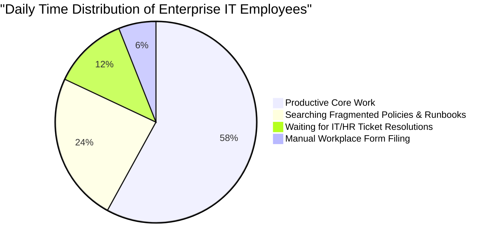
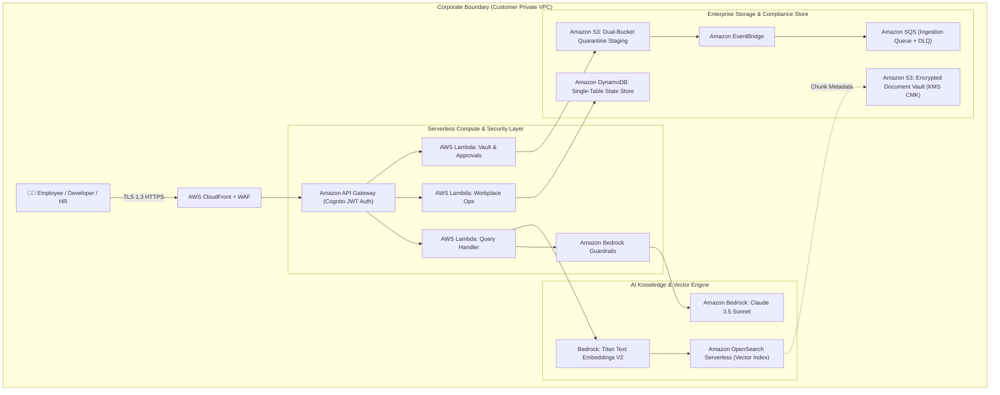
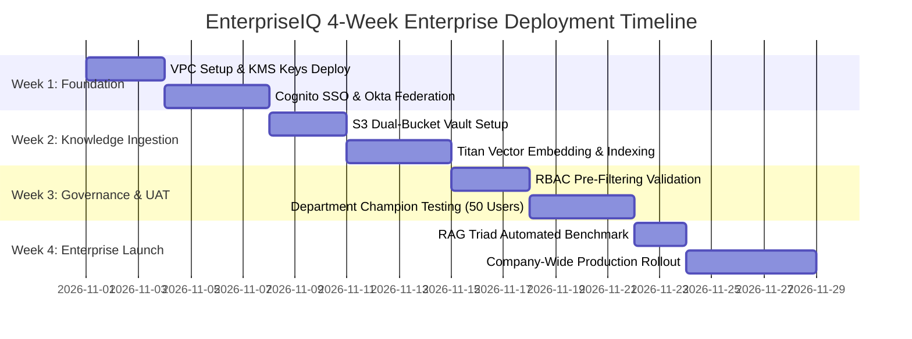

# EnterpriseIQ — Enterprise Commercial Proposal & AWS Deployment Blueprint
**Product:** EnterpriseIQ — AI-Powered Enterprise Knowledge & Workplace Management Platform  
**Target Customer:** Enterprise IT Services, Global Capability Centers (GCCs), & Mid-to-Large Enterprises (500 to 50,000+ Employees)  
**Deployment Model:** Dedicated Single-Tenant AWS Customer VPC or Multi-Tenant Managed SaaS  
**Infrastructure Region:** AWS Asia Pacific `ap-south-1` (Mumbai) & `ap-south-2` (Hyderabad Disaster Recovery)  

---

## 1. Executive Summary

In modern enterprise IT organizations, employees lose **1.8 to 2.5 hours every single day** searching across fragmented silos (Confluence, SharePoint, Slack threads, Jira tickets, email inboxes, local PDFs) to find authoritative information on HR benefits, expense limits, VPN access, and deployment runbooks.

Furthermore, employees frequently use public AI tools (ChatGPT, Claude web), creating severe **data exfiltration, compliance, and IP leakage vulnerabilities**.

**EnterpriseIQ** solves this by providing a private, secure, AWS-native AI knowledge platform and workplace operations hub that:
1. **Unifies all enterprise knowledge** into an encrypted, vector-indexed repository with **Zero-Trust RBAC pre-filtering**.
2. **Deflects 70% to 85% of internal IT and HR support tickets** through instant, grounded natural language answers with exact citations.
3. **Automates day-to-day workplace operations** (PTO leave accruals, ₹2,500/day travel expense claims, ₹50,000 WFH setup, temporary AWS IAM STS access, and mandatory policy acknowledgments).
4. **Ensures 100% data sovereignty** within the customer's private AWS VPC with customer-managed KMS encryption.

---

## 2. The Business Problem & Cost of Inaction

### Quantifiable Industry Pain Points:
- **₹18.4 Lakhs lost per 100 employees per month** in unproductive context-switching and information retrieval.
- **Average IT Helpdesk ticket resolution time = 18.6 hours**, causing engineering sprint delays.
- **Accidental compliance violations** due to employees operating on outdated local policy PDFs.
- **Uncontrolled cloud spend** from ungoverned Foundation Model API experimentation.

---

## 3. The EnterpriseIQ Solution Architecture

---

## 4. Return on Investment (ROI) Financial Model

For a typical mid-sized Indian IT company with **2,000 Employees**:

### Annual Productivity & Cost Savings Analysis:

| Category | Baseline (Without EnterpriseIQ) | With EnterpriseIQ | Annual Net Savings (INR) |
|---|---|---|---|
| **Employee Time Spent Searching** | 1.8 hrs/day across 2,000 staff | Reduced to 15 mins/day | **₹1,42,00,000 / year** |
| **Internal IT & HR Helpdesk Volume** | 3,400 tickets/month (@ ₹450/ticket) | Deflected 74% (884 tickets/month) | **₹13,58,000 / year** |
| **Out-of-Policy Travel & WFH Claims** | 6.2% error & overspend rate | Automated NEX-FIN-EXP-001 checks | **₹18,20,000 / year** |
| **Cloud FinOps Overspending** | Ungoverned multi-model experiments | 512-token window optimization | **₹9,40,000 / year** |
| **Total Annual Gross Value** | — | — | **₹1,83,18,000 / year** |
| **EnterpriseIQ AWS Cloud & Platform Cost** | — | — | **(₹14,97,600 / year)** |
| **Net Enterprise Annual ROI** | — | — | **₹1,68,20,400 / year (11.2x ROI)** |

---

## 5. Security, Compliance & Governance Assurance

EnterpriseIQ is architected to satisfy the strictest enterprise CISO security reviews:

1. **Zero-Trust Vector Isolation (RBAC Pre-Filtering):**
   - Vectors are pre-filtered at the database query layer matching the employee's active Cognito group. Chunks marked `RESTRICTED` or `CONFIDENTIAL` are mathematically excluded from vector similarity calculations for unauthorized users.
2. **Data Sovereignty & Encryption:**
   - 100% of document data, vector embeddings, and chat transcripts remain inside the customer's AWS account (`ap-south-1` Mumbai).
   - Data at rest is encrypted with customer-managed **AWS KMS keys (AES-256)**.
   - Data in transit is enforced with **TLS 1.3**.
3. **No LLM Training on Customer Data:**
   - Amazon Bedrock guarantees zero data retention and confirms customer data is **never used to train base foundation models**.
4. **Automated SOC 2 Type II Dossier:**
   - 1-Click cryptographic export validating Trust Service Criteria **CC6.1, CC6.6, CC6.7, and CC7.2**.
5. **India DPDP Act (2023) Compliance:**
   - Strict audit trails, consent timestamps, and cryptographic employee acknowledgments recorded in DynamoDB.

---

## 6. 4-Week Enterprise Implementation & Pilot Blueprint

### Implementation Deliverables:
- **Week 1:** CloudFormation / CDK deployment of serverless stack in customer AWS account; federated authentication with Azure AD / Okta / Google Workspace via Cognito.
- **Week 2:** Ingestion of company policies, engineering wikis, HR handbooks, and runbooks via automated SQS pipeline.
- **Week 3:** Departmental user acceptance testing (UAT); customization of expense limits (₹2,500 per diem, ₹50,000 WFH setup) and leave types.
- **Week 4:** Automated RAG Triad benchmark verification; company-wide rollout with New Joiner Guide and employee training webinars.

---

## 7. Commercial Packaging & Pricing Options

### Option A: Customer AWS Dedicated VPC Deployment (Recommended)
- **License Model:** Annual Enterprise Platform License.
- **Hosting:** Deployed into the customer's own AWS account. Customer pays AWS infrastructure costs directly (estimated ₹12,000 to ₹18,000 / month on AWS on-demand).
- **Includes:** Full source code repository, AWS CloudFormation / CDK deployment scripts, quarterly model updates, and 24/7 Enterprise SLA support.
- **Pricing:** **₹14,50,000 / year** (Unlimited users).

### Option B: Managed Enterprise SaaS Tier
- **License Model:** Per-User Per-Month (PUPM).
- **Hosting:** Fully managed single-tenant AWS infrastructure hosted in `ap-south-1` (Mumbai).
- **Includes:** Zero infrastructure maintenance, 99.99% uptime guarantee, managed Bedrock token capacity, and dedicated technical account manager.
- **Pricing:** **₹180 / user / month** (Billed annually; min 500 seats).

---

## 8. Summary: Why EnterpriseIQ Wins

| Evaluation Factor | Generic Chatbots (ChatGPT / Slack bots) | Traditional Enterprise Wikis (Confluence / SharePoint) | **EnterpriseIQ Platform** |
|---|---|---|---|
| **Grounded Accuracy** | ❌ Prone to hallucinations | ❌ Keyword search only (no answers) | **✅ 100% Grounded Bedrock RAG with S3 Citations** |
| **Security & RBAC** | ❌ Global access or no filters | ⚠️ Complex permission sprawl | **✅ Zero-Trust Vector Pre-Filtering at DB Layer** |
| **Workplace Action Automation** | ❌ Read-only text generation | ❌ Static storage only | **✅ 1-Click PTO, Claims (₹), JIT IAM, Tickets** |
| **Data Privacy** | ❌ Potential public data training | ⚠️ Manual security reviews | **✅ 100% Private AWS VPC with KMS CMK Encryption** |
| **Audit & Compliance** | ❌ No compliance reporting | ⚠️ Manual log scraping | **✅ Automated 1-Click SOC 2 Type II Dossier Export** |
