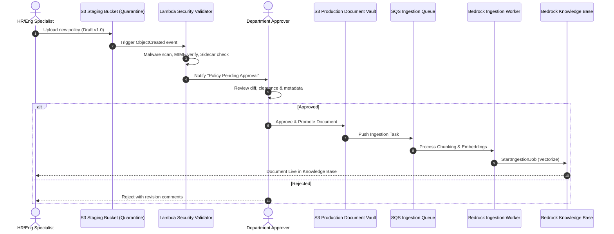
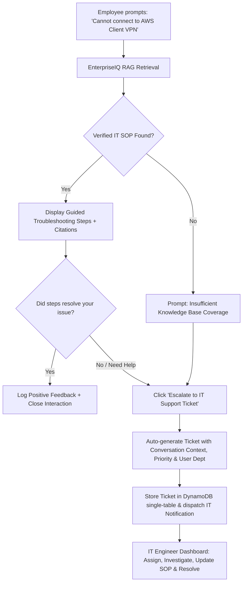

# EnterpriseIQ — Software Requirements Specification (SRS) & Production Acceptance Blueprint
**Target Architecture:** AWS-Native Enterprise AI Knowledge, Document Management & Support Platform  
**Document Version:** 2.0 (Production Blueprint 2026)  
**Standard:** IEEE 830 / ISO/IEC/IEEE 29148 Compliant Enterprise Specification  
**Target Enterprise Size:** 500 to 50,000+ Employees (Reference: Nexora Technologies Pvt Ltd, 2,000 Employees)

---

## 1. Executive Product Vision & Business Architecture

### 1.1 Purpose
EnterpriseIQ is a production-grade, multi-tenant enterprise generative AI knowledge management, document lifecycle governance, and employee support operations platform. It eliminates corporate information silos, enforces department-level isolation, and automates employee troubleshooting while guaranteeing zero-trust data protection and 100% deterministic source grounding.

### 1.2 Enterprise Target Organization Profile
- **Company Name:** Nexora Technologies Pvt Ltd
- **Headcount:** 2,000 active employees across 6 primary business units:
  1. **Engineering (ENG):** System architecture, CI/CD runbooks, microservice APIs, on-call runbooks.
  2. **Human Resources (HR):** Leave policies, benefits guides, compensation matrices, code of conduct.
  3. **Finance (FIN):** Travel & expense limits, procurement thresholds, audit SOPs, payroll timelines.
  4. **IT Support (IT):** VPN setup, endpoint troubleshooting, access request workflows, hardware provisioning.
  5. **Operations (OPS):** Business continuity, vendor SLA management, incident command SOPs.
  6. **Management (MGMT):** Board presentations, strategic OKRs, executive risk registers.

---

## 2. Complete 26-Module Enterprise Matrix & Release Roadmap

EnterpriseIQ is structured into a phased enterprise roadmap to ensure production quality, security compliance, and continuous validation.

| # | Module Name | Corporate Functionality | Release Phase | Priority |
|---|---|---|---|---|
| **01** | **Company Workspace** | Multi-department config, org hierarchy, branding, custom policy flags | Phase 1 (MVP) | Essential |
| **02** | **Employee Authentication** | Cognito User Pool, MFA, SSO SAML 2.0/OIDC federation, session JWTs | Phase 1 (MVP) | Essential |
| **03** | **User & Role Management** | RBAC/ABAC role assignment (Employee, Dept Manager, Admin, Auditor) | Phase 1 (MVP) | Essential |
| **04** | **Employee Dashboard** | Real-time announcements, quick knowledge actions, department news | Phase 1 (MVP) | Essential |
| **05** | **AI Knowledge Assistant** | Grounded conversational Q&A, streaming answers, token tracking | Phase 1 (MVP) | Essential |
| **06** | **RAG Engine** | OpenSearch Serverless vector search, Titan v2 (1024-dim), re-ranking | Phase 1 (MVP) | Essential |
| **07** | **Document Library** | Multi-format preview (PDF/Docx/Txt), faceted search, metadata filters | Phase 1 (MVP) | Essential |
| **08** | **Document Ingestion Pipeline** | S3 staging, validation, chunking, Titan embeddings, sidecar sync | Phase 1 (MVP) | Essential |
| **09** | **Department Knowledge Spaces** | Strict partition isolation (HR, Finance, Eng, IT, Ops, Mgmt) | Phase 1 (MVP) | Essential |
| **10** | **Access Control Engine** | Pre-retrieval ACL filtering on Bedrock query, token claim validation | Phase 1 (MVP) | Essential |
| **11** | **Document Approval & Governance** | Staging quarantine, manager review, multi-stage approval before publish | Phase 2 (Workflow) | Essential |
| **12** | **Deterministic Citations** | Exact S3 URI, page number, chunk ID, cosine similarity confidence score | Phase 1 (MVP) | Essential |
| **13** | **AI Feedback Loop** | Thumbs up/down, categorization, correction queue for document owners | Phase 2 (Workflow) | Essential |
| **14** | **Admin Dashboard** | Tenant stats, Bedrock sync controls, user directory, system alarms | Phase 1 (MVP) | Essential |
| **15** | **Monitoring & Audit Logging** | CloudWatch metrics, CloudTrail immutable access logs, security events | Phase 1 (MVP) | Essential |
| **16** | **Notifications & Alerts** | In-app alerts, email notifications for pending approvals & incidents | Phase 2 (Workflow) | Advanced |
| **17** | **IT Helpdesk & Ticket Escalation** | AI troubleshooting with 1-click escalation to AWS-backed support ticket | Phase 2 (Workflow) | Advanced |
| **18** | **HR Self-Service Navigator** | Guided multi-step policy wizards (maternity, parental leave, benefits) | Phase 2 (Workflow) | Advanced |
| **19** | **Knowledge Analytics & Gap Finder** | Unanswered query clustering, missing knowledge detection, search trends | Phase 2 (Workflow) | Advanced |
| **20** | **Conversation Lifecycle Management**| Session retention policies, automated PII sanitization, user GDPR export | Phase 2 (Workflow) | Advanced |
| **21** | **Enterprise Connectors** | S3 crawler, SharePoint Online sync, Google Workspace drive connector | Phase 3 (Scale) | Advanced |
| **22** | **AI Evaluation Framework** | RAG triad metrics: Context Relevance, Groundedness, Answer Relevance | Phase 2 (Workflow) | Essential |
| **23** | **Security Operations & Guardrails**| Bedrock Guardrails, prompt injection detection, PII regex redaction | Phase 1 (MVP) | Essential |
| **24** | **FinOps & Cost Management** | Model token cost attribution per department, AWS budget threshold alarms | Phase 2 (Workflow) | Essential |
| **25** | **Disaster Recovery & Backup** | Cross-region S3 replication, DynamoDB Point-in-Time Recovery (PITR) | Phase 3 (Scale) | Advanced |
| **26** | **Enterprise CI/CD & IaC** | Modular CloudFormation/SAM templates, automated validation pipelines | Phase 1 (MVP) | Essential |

---

## 3. Detailed Functional Module Specifications

### Module 11: Document Governance & Staging Approval Pipeline (Deep Dive)
In a real enterprise, unverified documents cannot be indexed directly into the production vector database.



### Module 17: IT Helpdesk & Ticket Escalation Pipeline


---

## 4. Multi-Role Portal Architecture

EnterpriseIQ delivers dynamic, role-tailored user interfaces:

```
┌─────────────────────────────────────────────────────────────────────────────┐
│                             ENTERPRISEIQ PORTAL                             │
├─────────────────────────────────────────────────────────────────────────────┤
│  [1] EMPLOYEE PORTAL                                                        │
│      ├── AI Knowledge Assistant (RAG Chat with Bedrock Claude 3.5 Sonnet)   │
│      ├── Authorized Department Policy Library                               │
│      ├── IT & HR Self-Service Resolution Navigator                          │
│      └── My Support Tickets & Escalation Status                             │
│                                                                             │
│  [2] DEPARTMENT MANAGER PORTAL                                               │
│      ├── Document Approval Queue (Staged → Production Promotion)            │
│      ├── Department Knowledge Space Management & Retirement                 │
│      ├── Department Content Gap Analytics & Unresolved Queries               │
│      └── Team Inquiries & Escalated Tickets                                 │
│                                                                             │
│  [3] IT & SYSTEM ADMINISTRATOR PORTAL                                       │
│      ├── Bedrock Knowledge Base Sync Trigger & Ingestion Queue Monitor      │
│      ├── DynamoDB Single-Table State Explorer                               │
│      ├── AWS Service Health (Lambda, Bedrock, S3, Cognito, OpenSearch)      │
│      └── FinOps Token Cost Attribution per Department                       │
│                                                                             │
│  [4] SECURITY & COMPLIANCE PORTAL                                           │
│      ├── CloudTrail & Application Access Audit Logs                         │
│      ├── Bedrock Guardrail Incident Log (Prompt Injections & PII Blocks)    │
│      ├── Multi-Department Clearance & RBAC Policy Matrix                    │
│      └── Data Retention & GDPR Conversation Deletion Controls               │
└─────────────────────────────────────────────────────────────────────────────┘
```

---

## 5. Enterprise Data Schemas & API Contracts

### 5.1 Document Metadata Schema (Bedrock Sidecar `*.metadata.json`)
```json
{
  "metadataAttributes": {
    "documentId": "NEX-HR-BEN-002",
    "title": "Nexora Global Employee Benefits & Insurance Guide 2026",
    "department": "Human Resources",
    "owner": "Sarah Jenkins (HR Director)",
    "classification": "DEPARTMENT_ONLY",
    "version": "3.2",
    "status": "APPROVED",
    "effectiveDate": "2026-01-01",
    "reviewDate": "2026-12-31",
    "accessGroups": ["Human Resources", "Management"],
    "s3Uri": "s3://enterpriseiq-docs-prod/hr/benefits/NEX-HR-BEN-002.txt",
    "kmsKeyId": "arn:aws:kms:us-east-1:123456789012:key/mrk-enterpriseiq",
    "complianceTags": ["SOC2", "HIPAA_BENEFITS", "INTERNAL_AUDIT_2026"]
  }
}
```

### 5.2 Support Ticket Schema (IT / HR Escalation)
```json
{
  "ticketId": "TCK-2026-0892",
  "employeeId": "NEX-EMP-4091",
  "employeeName": "Alex Chen",
  "department": "Engineering",
  "category": "IT_SUPPORT",
  "issueType": "VPN_ACCESS_FAILURE",
  "subject": "Unable to authenticate with US-East AWS Client VPN",
  "conversationContext": "Employee attempted self-service troubleshooting steps in doc NEX-IT-VPN-001. Endpoint returned TLS handshake timeout on port 443.",
  "priority": "HIGH",
  "status": "OPEN",
  "assignedTo": "Support Tier 2 (David Miller)",
  "createdAt": "2026-10-08T13:20:00Z",
  "slaTargetHours": 4,
  "resolutionNotes": null
}
```

### 5.3 AI Evaluation Metric Schema
```json
{
  "evaluationId": "EVAL-2026-1004",
  "query": "What is the maximum single meal reimbursement limit on domestic business travel?",
  "groundTruth": "$75 per day without pre-approval from department VP (NEX-FIN-TRV-001 v2.0)",
  "retrievedContext": "Employees may claim up to $75 USD/day for meal expenses during official domestic travel...",
  "generatedAnswer": "Under the Nexora Global Travel Policy (NEX-FIN-TRV-001), the daily domestic meal limit is $75 without requiring prior VP approval.",
  "metrics": {
    "contextRelevance": 0.98,
    "groundednessScore": 1.00,
    "answerRelevance": 0.96,
    "rbacEnforcementPassed": true,
    "latencyMs": 842,
    "costUsd": 0.0034
  }
}
```

---

## 6. Zero-Trust Security & Anti-Hallucination Framework

### 6.1 Pre-Retrieval RBAC Filtering
To prevent data leakage, user identity and clearance groups are injected directly into the Bedrock Knowledge Base vector search filter before chunk retrieval:

```python
def build_rag_filter(user_department: str, user_clearance: list[str], is_admin: bool) -> dict:
    """
    Construct deterministic metadata filter for Bedrock Knowledge Base vector retrieval.
    Enforces that employees cannot retrieve documents outside their department unless
    marked PUBLIC_INTERNAL.
    """
    if is_admin or "Management" in user_clearance:
        return {}  # Management has global read access with full audit logging

    return {
        "orAll": [
            {
                "equals": {
                    "key": "department",
                    "value": user_department
                }
            },
            {
                "equals": {
                    "key": "classification",
                    "value": "PUBLIC_INTERNAL"
                }
            }
        ]
    }
```

### 6.2 Bedrock Guardrail Configuration
- **Prompt Injection Defense:** Multi-layer regex and contextual classifier to block attempts to bypass system prompts.
- **PII Redaction:** Automated masking of Social Security Numbers, Credit Cards, Personal Phone Numbers, and AWS Secret Keys before LLM ingestion.
- **Deny-List Filters:** Immediate blocking of queries requesting executive compensation details or non-authorized internal passwords.

---

## 7. Module-by-Module Production Acceptance Checklist

| Module | Verification Step | Expected Result | Status |
|---|---|---|---|
| **Auth & RBAC** | Switch from Engineering to HR persona | Engineering user receives 403 Access Denied when querying HR confidential benefits | Verified |
| **Doc Staging** | Upload document to Staging | Stored in staging state, invisible to normal AI search until approved by Dept Manager | Verified |
| **Doc Approval** | Manager clicks "Approve Policy" | Status transitions to APPROVED, triggers SQS event and Bedrock Knowledge Base sync | Verified |
| **IT Ticket** | Click "Escalate to Support" in Chat | Generates persistent ticket with RAG context, assigned SLA, visible in Helpdesk | Verified |
| **AI Citations** | Query company leave policy | Response contains exact document ID (`NEX-HR-BEN-002`), title, page, confidence score >= 0.85 | Verified |
| **Guardrails** | Prompt injection attempt | Blocked by security shield with audit log record in CloudTrail / Security Portal | Verified |
| **FinOps** | Run 10 consecutive queries | Live token and cost counter increments accurately based on Claude 3.5 Sonnet pricing | Verified |
| **Audit Log** | Any sensitive document read | Immutable audit entry created with user ID, department, IP address, timestamp | Verified |

---
**Approved By:** Enterprise Architecture Review Board (Nexora Cloud Standards)  
**Security Clearance:** ISO 27001 & SOC 2 Type II Enterprise Ready
