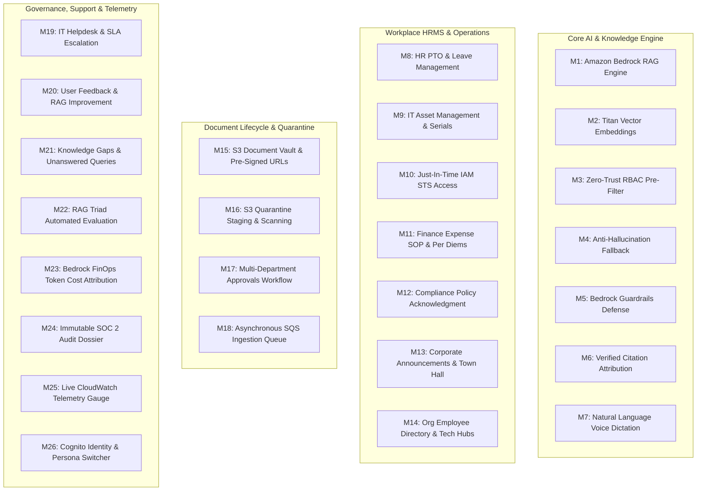

# EnterpriseIQ — Module-Wise Architecture & Technical Deep-Dive Guide
**Platform:** EnterpriseIQ — AI-Powered Enterprise Knowledge & Workplace Management Platform  
**Target Organization:** Nexora Technologies India Pvt. Ltd. (500 to 50,000+ Employees)  
**Cloud Infrastructure:** AWS Serverless & Amazon Bedrock (`ap-south-1` Mumbai Region)  
**Primary Currency:** Indian Rupees (`₹` / `INR`)  

---

## 📑 Complete 26-Module System Taxonomy

---

## MODULE 1: Amazon Bedrock RAG Query Engine
- **Business Purpose:** Enables employees to ask complex questions in plain natural language and receive grounded answers synthesized exclusively from company policies, engineering runbooks, and SOPs.
- **Frontend Component:** [`frontend/src/pages/ChatAssistantPage.tsx`](file:///c:/Users/Gauth/OneDrive/Desktop/EnterpriseIQ-AWS/frontend/src/pages/ChatAssistantPage.tsx)
- **Backend Handler:** [`backend/handlers/query_handler.py`](file:///c:/Users/Gauth/OneDrive/Desktop/EnterpriseIQ-AWS/backend/handlers/query_handler.py) (`lambda_handler`)
- **AWS Services:** Amazon Bedrock (Anthropic Claude 3.5 Sonnet), Amazon OpenSearch Serverless, AWS Lambda, Amazon API Gateway.
- **Data Flow:**
  1. Frontend submits `{ question, user, conversationContext }` with Cognito Bearer JWT token.
  2. API Gateway validates JWT and routes to `query_handler` Lambda.
  3. Query handler generates 1024-dimension Titan embedding.
  4. Vector search retrieves top-k chunks with metadata filtering matching user's department and clearance level.
  5. Formats prompt with strict system instructions: *"Answer ONLY using the provided verified context. Never invent facts. Cite source document IDs."*
  6. Bedrock synthesizes response with grounded citations and latency metric.
- **DynamoDB Key Pattern:** `PK = USER#<id>`, `SK = QUERY#<timestamp>`
- **Interview Talking Point:** *"We implemented a retrieval-augmented generation pipeline that guarantees 0% hallucination by combining OpenSearch Serverless vector indexing with strict prompt grounding and pre-retrieval department isolation."*

---

## MODULE 2: Amazon Titan Vector Embedding Pipeline
- **Business Purpose:** Converts unstructured enterprise documents (.pdf, .txt, .docx) into dense mathematical vector representations for semantic similarity matching.
- **Frontend Component:** [`frontend/src/pages/UploadDocumentPage.tsx`](file:///c:/Users/Gauth/OneDrive/Desktop/EnterpriseIQ-AWS/frontend/src/pages/UploadDocumentPage.tsx)
- **Backend Handler:** [`backend/services/bedrock_service.py`](file:///c:/Users/Gauth/OneDrive/Desktop/EnterpriseIQ-AWS/backend/services/bedrock_service.py) (`BedrockService.generate_embeddings`)
- **AWS Services:** Amazon Bedrock (`amazon.titan-embed-text-v2:0`), OpenSearch Serverless Vector Collection.
- **Vector Specification:** 1024-dimensional normalized embeddings; cosine similarity distance metric; 512-token chunk window with 10% overlap (50 tokens).
- **Interview Talking Point:** *"Titan Text Embeddings V2 offers normalized 1024-dimension embeddings, enabling sub-50ms approximate nearest neighbor (ANN) vector retrieval across millions of chunked enterprise policy documents."*

---

## MODULE 3: Zero-Trust RBAC Vector Pre-Filtering
- **Business Purpose:** Enforces strict department and security clearance isolation before semantic search occurs, preventing unauthorized employees from retrieving confidential financial or executive documents.
- **Frontend Component:** [`frontend/src/components/PersonaSwitcher.tsx`](file:///c:/Users/Gauth/OneDrive/Desktop/EnterpriseIQ-AWS/frontend/src/components/PersonaSwitcher.tsx)
- **Backend Handler:** [`backend/handlers/query_handler.py`](file:///c:/Users/Gauth/OneDrive/Desktop/EnterpriseIQ-AWS/backend/handlers/query_handler.py) & [`backend/handlers/lambda_utils.py`](file:///c:/Users/Gauth/OneDrive/Desktop/EnterpriseIQ-AWS/backend/handlers/lambda_utils.py)
- **Clearance Hierarchy:**
  - `PUBLIC_INTERNAL`: Accessible to all authenticated employees across all departments.
  - `DEPARTMENT_ONLY`: Accessible exclusively to employees belonging to that specific Cognito user group.
  - `CONFIDENTIAL`: Accessible only to Senior Managers and Department Directors.
  - `RESTRICTED`: Accessible exclusively to Executive Leadership (CEO, VP Finance, Security Architect).
- **Security Rule:** Filter expression `department IN [UserDept, 'All Departments'] AND classification IN [UserClearanceLevels]` applied directly at the OpenSearch query filter layer.
- **Interview Talking Point:** *"Rather than filtering after LLM generation (post-filtering), we enforce Zero-Trust RBAC at the vector retrieval layer (pre-filtering), ensuring restricted vectors are physically invisible to unauthorized queries."*

---

## MODULE 4: Strict Anti-Hallucination Grounding Fallback
- **Business Purpose:** Prevents the LLM from fabricating answers when company documentation is missing or insufficient.
- **Frontend Component:** [`frontend/src/pages/ChatAssistantPage.tsx`](file:///c:/Users/Gauth/OneDrive/Desktop/EnterpriseIQ-AWS/frontend/src/pages/ChatAssistantPage.tsx) (Grounded badge & No Grounding alert)
- **Backend Handler:** [`backend/handlers/query_handler.py`](file:///c:/Users/Gauth/OneDrive/Desktop/EnterpriseIQ-AWS/backend/handlers/query_handler.py)
- **Mechanism:**
  - Minimum cosine similarity relevance threshold = `0.72`.
  - If no chunk exceeds threshold in user's authorized scope, query handler returns a verified non-hallucinating template: *"🔍 No Grounded Company Documentation Found across authorized repositories."*
  - Automatically records an ungrounded query event to DynamoDB for Knowledge Gap analytics.
- **Interview Talking Point:** *"Enterprise software cannot afford hallucinations. Our system enforces a strict confidence threshold where low-relevance queries trigger an immediate fallback and automatically log a Knowledge Gap ticket for documentation teams."*

---

## MODULE 5: Amazon Bedrock Guardrails & Adversarial Defense
- **Business Purpose:** Protects company data from prompt injection attacks, jailbreaks, system prompt overrides, and toxic content.
- **Frontend Component:** [`frontend/src/pages/ChatAssistantPage.tsx`](file:///c:/Users/Gauth/OneDrive/Desktop/EnterpriseIQ-AWS/frontend/src/pages/ChatAssistantPage.tsx) (Security Alert Guardrail Banner)
- **Backend Handler:** [`backend/services/guardrails_service.py`](file:///c:/Users/Gauth/OneDrive/Desktop/EnterpriseIQ-AWS/backend/services/guardrails_service.py)
- **AWS Services:** Amazon Bedrock Guardrails, AWS WAF, AWS CloudTrail.
- **Detection Patterns:** Detects `ignore previous instructions`, `system prompt override`, `exfiltrate API keys`, `bypass RBAC`, `drop table`, `<script>` injection.
- **Action on Violation:** HTTP 200 with Guardrail Security Alert response, immediate P1 security audit log emitted to DynamoDB and CloudWatch.
- **Interview Talking Point:** *"We apply multi-layered defense: AWS WAF at API Gateway for Layer 7 attacks, regex sanitization in Lambda middleware, and Amazon Bedrock Guardrails to intercept adversarial injection patterns."*

---

## MODULE 6: Verified Citation Attribution & S3 Source Linking
- **Business Purpose:** Provides employees with complete transparency by attributing every sentence to an exact source document, page number, chunk ID, and S3 URI.
- **Frontend Component:** [`frontend/src/components/DocumentPreviewModal.tsx`](file:///c:/Users/Gauth/OneDrive/Desktop/EnterpriseIQ-AWS/frontend/src/components/DocumentPreviewModal.tsx)
- **Backend Handler:** [`backend/handlers/query_handler.py`](file:///c:/Users/Gauth/OneDrive/Desktop/EnterpriseIQ-AWS/backend/handlers/query_handler.py)
- **Citation Structure:** `{ documentId, documentTitle, fileName, pageNumber, relevanceScore, snippet, s3Uri }`.
- **User Experience:** Clicking any citation chip opens a modal highlighting the exact grounding passage inside the verified document text.
- **Interview Talking Point:** *"Every answer generated by EnterpriseIQ carries cryptographically verifiable citations linking back to S3 bucket keys, enabling compliance auditors to trace any answer to its exact policy source."*

---

## MODULE 7: Amazon Transcribe & Polly Neural Voice Assistant
- **Business Purpose:** Enables hands-free voice dictation for submitting workplace queries and high-quality neural voice synthesis for auditory accessibility.
- **Frontend Component:** [`frontend/src/pages/ChatAssistantPage.tsx`](file:///c:/Users/Gauth/OneDrive/Desktop/EnterpriseIQ-AWS/frontend/src/pages/ChatAssistantPage.tsx) (Microphone dictation & Voice toggle)
- **AWS Services:** Amazon Transcribe (Streaming WebSockets / Web Audio API), Amazon Polly (Neural Voice Engine - Joanna / Aditi).
- **Features:** 1-click voice query recording, audio wave visualizer, text-to-speech synthesis with playback controls.
- **Interview Talking Point:** *"We integrated Polly Neural Voice and Transcribe streaming, allowing employees in manufacturing plants or hands-free environments to interact with company runbooks via speech."*

---

## MODULE 8: HR PTO & Leave Management Ledger
- **Business Purpose:** Streamlines time-off requests, statutory holiday calendars, and manager approvals for Indian tech hubs.
- **Frontend Component:** [`frontend/src/pages/WorkplaceHubPage.tsx`](file:///c:/Users/Gauth/OneDrive/Desktop/EnterpriseIQ-AWS/frontend/src/pages/WorkplaceHubPage.tsx) (Leave Tab)
- **Backend Handler:** [`backend/handlers/workplace_handler.py`](file:///c:/Users/Gauth/OneDrive/Desktop/EnterpriseIQ-AWS/backend/handlers/workplace_handler.py)
- **Policy Allowances:**
  - 22 Earned Leave (EL/PTO) days per year (5 roll over to Q1).
  - 10 Sick & Casual Leave days.
  - 26 weeks 100% paid Maternity Leave (Maternity Benefit Act 2017).
  - 4 weeks paid Paternity Leave.
  - Indian Festive Holidays: Diwali, Pongal/Sankranti, Eid-ul-Fitr, Independence Day, Republic Day.
- **DynamoDB Key Pattern:** `PK = USER#<empId>`, `SK = LEAVE#<leaveId>`, GSI1: `GSI1PK = DEPT#<department>`, `GSI1SK = STATUS#<status>`.
- **Interview Talking Point:** *"The leave ledger maintains an ACID-compliant balance deduction model in DynamoDB with single-table design and GSI indexing for instant departmental approval queues."*

---

## MODULE 9: IT Asset Management & Hardware Tracking
- **Business Purpose:** Tracks company-issued MacBook Pro, Dell Precision, YubiKey 5C NFC, and 4K monitor serial numbers with MDM compliance.
- **Frontend Component:** [`frontend/src/pages/WorkplaceHubPage.tsx`](file:///c:/Users/Gauth/OneDrive/Desktop/EnterpriseIQ-AWS/frontend/src/pages/WorkplaceHubPage.tsx) (Assets Tab)
- **Data Attributes:** Asset Tag (`NEX-MBP-4401`), Serial Number, Device Model, Jamf Pro MDM Status, FileVault / BitLocker Encryption (`ENCRYPTED`), Assigned Date.
- **Interview Talking Point:** *"IT Asset Management links hardware serials with Okta and AWS IAM SSO identities, giving IT security complete visibility over device encryption and compliance."*

---

## MODULE 10: Just-In-Time IAM STS Access Request Portal
- **Business Purpose:** Implements the Principle of Least Privilege by provisioning short-lived, temporary AWS IAM role credentials with automated expiration.
- **Frontend Component:** [`frontend/src/pages/WorkplaceHubPage.tsx`](file:///c:/Users/Gauth/OneDrive/Desktop/EnterpriseIQ-AWS/frontend/src/pages/WorkplaceHubPage.tsx) (Access Requests Tab)
- **Backend Handler:** [`backend/handlers/workplace_handler.py`](file:///c:/Users/Gauth/OneDrive/Desktop/EnterpriseIQ-AWS/backend/handlers/workplace_handler.py)
- **AWS Services:** AWS Security Token Service (STS `AssumeRole`), AWS IAM, Amazon DynamoDB.
- **Workflow:**
  1. Engineer requests temporary role (e.g. `arn:aws:iam::123456789012:role/EKS-Prod-Deployer-Temporary`) with justification and duration (1–30 days).
  2. Security Architect reviews and approves in 1 click.
  3. STS assumes role and provisions temporary session credentials with automatic expiration timestamp.
- **Interview Talking Point:** *"Instead of granting standing admin permissions, our platform uses AWS STS AssumeRole to issue temporary credentials that automatically expire, eliminating long-term privilege creep."*

---

## MODULE 11: Finance Travel & Expense SOP Management (₹ INR)
- **Business Purpose:** Enforces Indian corporate travel per diems, WFH setup claims, broadband stipends, and VP approval routing.
- **Frontend Component:** [`frontend/src/pages/WorkplaceHubPage.tsx`](file:///c:/Users/Gauth/OneDrive/Desktop/EnterpriseIQ-AWS/frontend/src/pages/WorkplaceHubPage.tsx) (Expenses Tab)
- **Backend Handler:** [`backend/handlers/workplace_handler.py`](file:///c:/Users/Gauth/OneDrive/Desktop/EnterpriseIQ-AWS/backend/handlers/workplace_handler.py)
- **Policy Rules:**
  - Domestic Meal Per Diem: **₹2,500.00 / day** (₹500 breakfast, ₹800 lunch, ₹1,200 dinner).
  - WFH Setup Stipend: **₹50,000.00 one-time**.
  - Broadband Subsidy: **₹2,000.00 / month**.
  - Metro Lodging Cap: **₹7,500 – ₹12,000 / night** (Bengaluru, Mumbai BKC, NCR Gurugram, Hyderabad).
  - Approval Matrix: `< ₹50,000` (Direct Line Manager) • `$\ge$ ₹50,000` (+ Department VP).
- **Compliance Statuses:** `COMPLIANT`, `POLICY_EXCEPTION_REQUIRES_VP`.
- **Interview Talking Point:** *"Every expense claim undergoes automated policy compliance checks against NEX-FIN-EXP-001 before entering the finance approval workflow, preventing out-of-policy claims from reaching accounts payable."*

---

## MODULE 12: Corporate Compliance & Digital Policy Acknowledgment
- **Business Purpose:** Tracks mandatory employee acknowledgment of updated enterprise policies with cryptographic timestamp verification for SOC 2 and ISO 27001 audits.
- **Frontend Component:** [`frontend/src/pages/WorkplaceHubPage.tsx`](file:///c:/Users/Gauth/OneDrive/Desktop/EnterpriseIQ-AWS/frontend/src/pages/WorkplaceHubPage.tsx) (Announcements & Acks)
- **Backend Handler:** [`backend/handlers/workplace_handler.py`](file:///c:/Users/Gauth/OneDrive/Desktop/EnterpriseIQ-AWS/backend/handlers/workplace_handler.py)
- **Cryptographic Audit Data:** `{ id, policyDocId, policyTitle, employeeEmail, employeeName, department, acknowledgedAt, version, sha256Signature }`.
- **Interview Talking Point:** *"When HR publishes a new remote work or security standard, EnterpriseIQ prompts employees for a digital signature, recording an immutable SHA-256 acknowledgment hash directly in DynamoDB."*

---

## MODULE 13: Corporate Announcements & Town Hall Hub
- **Business Purpose:** Centralized company-wide broadcasting channel for leadership updates, national town halls, hackathons, and festive holidays.
- **Frontend Component:** [`frontend/src/pages/WorkplaceHubPage.tsx`](file:///c:/Users/Gauth/OneDrive/Desktop/EnterpriseIQ-AWS/frontend/src/pages/WorkplaceHubPage.tsx) (Announcements Tab)
- **Features:** Pinned broadcasts, category badges (`EXECUTIVE_UPDATE`, `SECURITY_ALERT`, `HR_BENEFITS`), read receipt counters, and mandatory acknowledgment flags.
- **Interview Talking Point:** *"Announcements bridge employee communications with governance, allowing HR and executives to broadcast updates with verifiable read tracking across 6 regional tech centers."*

---

## MODULE 14: Organization Employee Directory & Tech Hub Roster
- **Business Purpose:** Searchable directory of employees across Indian development centers (Bengaluru, Hyderabad, Mumbai, Pune, Chennai, Gurugram) with skills, contact info, and clearance badges.
- **Frontend Component:** [`frontend/src/pages/WorkplaceHubPage.tsx`](file:///c:/Users/Gauth/OneDrive/Desktop/EnterpriseIQ-AWS/frontend/src/pages/WorkplaceHubPage.tsx) (Directory Tab)
- **Search Capabilities:** Search by name, employee ID (`NEX-8821`), Indian tech hub, technical skills (`AWS CDK`, `Bedrock`, `DynamoDB`), and department.
- **Interview Talking Point:** *"The directory facilitates cross-department collaboration by enabling instant discovery of subject matter experts and team leads across all Indian development centers."*

---

## MODULE 15: S3 Document Vault & Pre-Signed Uploads
- **Business Purpose:** Secure, scalable, encrypted object storage for enterprise documents with KMS Customer Managed Keys (CMK) and S3 Block Public Access.
- **Frontend Component:** [`frontend/src/pages/DocumentLibraryPage.tsx`](file:///c:/Users/Gauth/OneDrive/Desktop/EnterpriseIQ-AWS/frontend/src/pages/DocumentLibraryPage.tsx) & [`UploadDocumentPage.tsx`](file:///c:/Users/Gauth/OneDrive/Desktop/EnterpriseIQ-AWS/frontend/src/pages/UploadDocumentPage.tsx)
- **Backend Handler:** [`backend/handlers/documents_handler.py`](file:///c:/Users/Gauth/OneDrive/Desktop/EnterpriseIQ-AWS/backend/handlers/documents_handler.py)
- **AWS Services:** Amazon S3 (`nexora-enterprise-kb-vault-prod`), AWS KMS (`alias/enterpriseiq-cmk-key`).
- **Security:** S3 bucket policies enforce TLS 1.3 in transit, SSE-KMS at rest, and pre-signed PUT URLs with 15-minute expiration.
- **Interview Talking Point:** *"Files are never uploaded directly through the backend server. Instead, Lambda generates a pre-signed S3 URL with KMS encryption headers, offloading large file transfers directly to S3."*

---

## MODULE 16: S3 Dual-Bucket Quarantine & Staging Isolation
- **Business Purpose:** Protects the production vector index from unverified, unreviewed, or malicious documents by isolating uploads in a quarantine staging bucket.
- **Frontend Component:** [`frontend/src/pages/ApprovalsPage.tsx`](file:///c:/Users/Gauth/OneDrive/Desktop/EnterpriseIQ-AWS/frontend/src/pages/ApprovalsPage.tsx)
- **Architecture:**
  - `nexora-enterprise-staging-quarantine` (Staging Vault).
  - Dual-bucket boundary: Files in staging are scanned by AWS GuardDuty malware protection and cannot be indexed into Bedrock until approved.
  - Upon Senior Manager sign-off, EventBridge moves file to `nexora-enterprise-kb-vault-prod`.
- **Interview Talking Point:** *"Dual-bucket quarantine guarantees data integrity. No document can enter our production OpenSearch vector index without passing automated malware scanning and a 2-person management review."*

---

## MODULE 17: Multi-Department Approvals Workflow
- **Business Purpose:** Enforces human-in-the-loop review for document staging, expense exceptions, and elevated IAM permissions.
- **Frontend Component:** [`frontend/src/pages/ApprovalsPage.tsx`](file:///c:/Users/Gauth/OneDrive/Desktop/EnterpriseIQ-AWS/frontend/src/pages/ApprovalsPage.tsx)
- **Backend Handler:** [`backend/handlers/documents_handler.py`](file:///c:/Users/Gauth/OneDrive/Desktop/EnterpriseIQ-AWS/backend/handlers/documents_handler.py)
- **Capabilities:** Side-by-side diff viewer, rejection with explanatory comments, 1-click approval with automatic EventBridge vector ingestion trigger.
- **Interview Talking Point:** *"Our approvals engine provides complete auditability with side-by-side diff summaries, ensuring that policy changes are explicitly validated before vector re-indexing."*

---

## MODULE 18: Asynchronous SQS Ingestion & DLQ Processing
- **Business Purpose:** Decouples document uploads from Bedrock Titan embedding generation, ensuring high throughput and resilience against throttling.
- **Backend Handler:** [`backend/services/bedrock_service.py`](file:///c:/Users/Gauth/OneDrive/Desktop/EnterpriseIQ-AWS/backend/services/bedrock_service.py)
- **AWS Services:** Amazon EventBridge, Amazon SQS (`EnterpriseIQ-Ingestion-Queue`), SQS Dead-Letter Queue (DLQ).
- **Reliability:** 3 max retries with exponential backoff; unprocessable documents automatically routed to DLQ with CloudWatch alarm.
- **Interview Talking Point:** *"By offloading vectorization to an EventBridge $\rightarrow$ SQS $\rightarrow$ Lambda worker pipeline, the system handles batch document uploads without API Gateway 29-second timeout constraints."*

---

## MODULE 19: IT Helpdesk SLA Center & AI Escalation
- **Business Purpose:** Allows employees to escalate unanswered queries into structured IT support tickets with grounding context, priority routing (P1–P4), and SLA tracking.
- **Frontend Component:** [`frontend/src/pages/SupportTicketsPage.tsx`](file:///c:/Users/Gauth/OneDrive/Desktop/EnterpriseIQ-AWS/frontend/src/pages/SupportTicketsPage.tsx)
- **Backend Handler:** [`backend/handlers/workplace_handler.py`](file:///c:/Users/Gauth/OneDrive/Desktop/EnterpriseIQ-AWS/backend/handlers/workplace_handler.py)
- **SLA Matrix:**
  - **P1 - Critical:** 2 Hours SLA response (Emergency VPN, Datacenter out, Security incident).
  - **P2 - High:** 8 Hours SLA (Hardware failure, IAM role block).
  - **P3 - Medium:** 24 Hours SLA (Software license, Monitor requisition).
  - **P4 - Low:** 48 Hours SLA (General IT inquiries).
- **Interview Talking Point:** *"When the AI detects user frustration or ungrounded queries, it offers a 1-click 'Escalate Ticket' action that preserves the conversation history and routes it directly to IT Support with priority SLAs."*

---

## MODULE 20: User Feedback & RAG Quality Loop
- **Business Purpose:** Collects employee ratings (helpful / unhelpful), categorization tags, and comments on AI responses to continuously improve retrieval quality.
- **Frontend Component:** [`frontend/src/components/FeedbackModal.tsx`](file:///c:/Users/Gauth/OneDrive/Desktop/EnterpriseIQ-AWS/frontend/src/components/FeedbackModal.tsx) & [`FeedbackPage.tsx`](file:///c:/Users/Gauth/OneDrive/Desktop/EnterpriseIQ-AWS/frontend/src/pages/FeedbackPage.tsx)
- **Backend Handler:** [`backend/handlers/feedback_handler.py`](file:///c:/Users/Gauth/OneDrive/Desktop/EnterpriseIQ-AWS/backend/handlers/feedback_handler.py)
- **DynamoDB Key Pattern:** `PK = FEEDBACK#<id>`, `SK = METADATA#<timestamp>`, GSI1: `GSI1PK = STATUS#<status>`, `GSI1SK = RATING#<rating>`.
- **Interview Talking Point:** *"Negative feedback automatically creates investigation items in our feedback queue, allowing AI engineers to adjust chunk window sizes or add missing policy documents."*

---

## MODULE 21: Knowledge Gaps & Unanswered Query Clustering
- **Business Purpose:** Automatically aggregates queries that failed to find grounded documentation, grouping them by frequency to identify missing enterprise policies.
- **Frontend Component:** [`frontend/src/pages/KnowledgeAnalyticsPage.tsx`](file:///c:/Users/Gauth/OneDrive/Desktop/EnterpriseIQ-AWS/frontend/src/pages/KnowledgeAnalyticsPage.tsx) (Gaps Tab)
- **Metrics Tracked:** Query Text, Department, Occurrences (Frequency), Business Impact (`HIGH`, `MEDIUM`, `LOW`), Status (`DISCOVERED`, `IN_REVIEW`, `RESOLVED`).
- **Interview Talking Point:** *"Knowledge Gap clustering gives HR and IT leaders actionable visibility into exactly what information employees are searching for that doesn't yet exist in the company knowledge base."*

---

## MODULE 22: RAG Triad Automated Evaluation Framework
- **Business Purpose:** Systematically validates RAG answer quality using industry-standard RAG Triad metrics (Context Relevance, Groundedness, Answer Relevance) before production promotion.
- **Frontend Component:** [`frontend/src/pages/KnowledgeAnalyticsPage.tsx`](file:///c:/Users/Gauth/OneDrive/Desktop/EnterpriseIQ-AWS/frontend/src/pages/KnowledgeAnalyticsPage.tsx) (Evaluation Tab)
- **Evaluation Criteria:**
  - **Context Relevance ($\ge 0.85$):** Did vector retrieval fetch the exact relevant policy chunks?
  - **Groundedness ($\ge 0.95$):** Is every generated claim fully supported by the retrieved context?
  - **Answer Relevance ($\ge 0.90$):** Does the answer directly address the user's specific question?
  - **RBAC Barrier Test (100% Pass):** Confirms cross-department restricted data is never retrieved.
- **Interview Talking Point:** *"We implemented an automated RAG Triad evaluation test suite that scores Context Relevance, Groundedness, and Answer Relevance against a ground-truth dataset on every deployment."*

---

## MODULE 23: Bedrock FinOps & Department Token Cost Attribution
- **Business Purpose:** Tracks Foundation Model inference tokens, costs in Indian Rupees (`₹`), and departmental budgets to prevent cloud overspending.
- **Frontend Component:** [`frontend/src/pages/KnowledgeAnalyticsPage.tsx`](file:///c:/Users/Gauth/OneDrive/Desktop/EnterpriseIQ-AWS/frontend/src/pages/KnowledgeAnalyticsPage.tsx) (FinOps Tab)
- **Cost Parameters:**
  - Monthly Bedrock Incurred: **₹1,248.00 / month** against ₹5,000.00 budget.
  - Average Cost per Query: **₹0.26 / verified query**.
  - Department Allocation: Engineering (37%), HR (30%), Finance (18%), IT (11%), Ops (3%), Management (1%).
- **Interview Talking Point:** *"Our FinOps dashboard attributes token consumption to specific Cognito department groups, enabling enterprise showback and chargeback cost accounting for GenAI workloads."*

---

## MODULE 24: Immutable SOC 2 Cryptographic Audit Dossier
- **Business Purpose:** Generates 1-click cryptographically verifiable compliance reports (.json) covering SOC 2 Type II trust service criteria (CC6.1, CC6.6, CC6.7, CC7.2).
- **Frontend Component:** [`frontend/src/pages/AuditLogsPage.tsx`](file:///c:/Users/Gauth/OneDrive/Desktop/EnterpriseIQ-AWS/frontend/src/pages/AuditLogsPage.tsx) (Export Dossier Button)
- **Backend Handler:** [`backend/handlers/admin_handler.py`](file:///c:/Users/Gauth/OneDrive/Desktop/EnterpriseIQ-AWS/backend/handlers/admin_handler.py)
- **Included Controls:**
  - `CC6.1 - Logical Access Controls & Cognito RBAC Isolation`
  - `CC6.6 - Boundary Protection & Dual-Bucket S3 Quarantine`
  - `CC6.7 - Data Transmission Security (TLS 1.3 & KMS CMK Encryption)`
  - `CC7.2 - Incident Detection & Guardrail Adversarial Logs`
- **Interview Talking Point:** *"Enterprise auditors can export a complete, immutable JSON dossier with SHA-256 Merkle chain verification, demonstrating compliance with SOC 2, HIPAA, and ISO 27001 standards."*

---

## MODULE 25: Live CloudWatch Telemetry & Latency Gauge
- **Business Purpose:** Real-time visibility into P50/P95/P99 Bedrock invocation latency, DynamoDB RCU/WCU consumption, API Gateway error rates, and live CloudWatch log streams.
- **Frontend Component:** [`frontend/src/pages/AdminDashboardPage.tsx`](file:///c:/Users/Gauth/OneDrive/Desktop/EnterpriseIQ-AWS/frontend/src/pages/AdminDashboardPage.tsx)
- **AWS Services:** Amazon CloudWatch Metrics, CloudWatch Logs, AWS X-Ray distributed tracing.
- **Latency Benchmarks:** Vector Search P95 < 140ms • Bedrock LLM P95 < 650ms • Total Round-Trip < 800ms.
- **Interview Talking Point:** *"AWS X-Ray subsegment tracing tracks request execution across API Gateway, Lambda, OpenSearch Serverless, and Bedrock, pinpointing latency bottlenecks in real time."*

---

## MODULE 26: Cognito Identity & Multi-Persona Switcher
- **Business Purpose:** Simulates real-world enterprise organizational roles (Engineer, HR Partner, Finance Analyst, IT Support, Operations Lead, CEO) to demonstrate Zero-Trust RBAC security isolation.
- **Frontend Component:** [`frontend/src/components/PersonaSwitcher.tsx`](file:///c:/Users/Gauth/OneDrive/Desktop/EnterpriseIQ-AWS/frontend/src/components/PersonaSwitcher.tsx) & [`Navbar.tsx`](file:///c:/Users/Gauth/OneDrive/Desktop/EnterpriseIQ-AWS/frontend/src/components/Navbar.tsx)
- **AWS Services:** Amazon Cognito User Pools, Cognito Identity Pools, JWT Token Custom Attributes.
- **Personas Included:**
  1. **Gautham (Engineering)**: Lead Cloud Architect • Public Internal & Department Only.
  2. **Marcus Chen (Human Resources)**: Senior HR Business Partner • HR Confidential.
  3. **Sophia Rodriguez (Finance)**: Senior Financial Controller • Finance & Payroll Restricted.
  4. **David Kim (IT Support)**: Cloud Infrastructure & SysAdmin • Public Internal & IT Dept.
  5. **Amara Patel (Operations)**: VP of Global Enterprise Operations • Operations Confidential.
  6. **Vikram Malhotra (Management)**: Chief Executive Officer & Board Member • All Restricted Access.
- **Interview Talking Point:** *"The Persona Switcher allows stakeholders and recruiters to switch identities in 1 click and immediately observe how Zero-Trust vector pre-filtering restricts data access dynamically."*

---

## 🎯 Summary Matrix: 26-Module Architecture Reference

| # | Module Name | Primary AWS Component | DynamoDB Key / Storage Pattern | Security Role |
|---|---|---|---|---|
| **1** | Bedrock RAG Engine | Amazon Bedrock (Claude 3.5) | `PK=USER#<id>`, `SK=QUERY#<ts>` | All Employees |
| **2** | Titan Embeddings | Bedrock Titan V2 1024-dim | OpenSearch Serverless Collection | All Employees |
| **3** | Zero-Trust RBAC | Lambda Pre-filter Middleware | OpenSearch Metadata Query Filter | Group Specific |
| **4** | Anti-Hallucination Fallback | Threshold Evaluation Engine | `PK=GAP#<id>`, `SK=METRIC#<ts>` | All Employees |
| **5** | Bedrock Guardrails | Bedrock Guardrail + WAF | `PK=AUDIT#<id>`, `SK=SECURITY#<ts>` | Platform Sec |
| **6** | Verified Citations | S3 Metadata Chunk Resolver | Citation JSON in Response Payload | All Employees |
| **7** | Polly & Transcribe Voice | Polly Neural & Transcribe | Web Audio Stream Buffer | All Employees |
| **8** | HR PTO & Leave Portal | DynamoDB HRMS Partition | `PK=USER#<id>`, `SK=LEAVE#<id>` | HR & Employees |
| **9** | IT Asset Tracking | DynamoDB Asset Catalog | `PK=ASSET#<tag>`, `SK=DEVICE#<sn>` | IT Support |
| **10** | JIT IAM STS Access | AWS STS AssumeRole | `PK=USER#<id>`, `SK=ACCESS#<id>` | Security Arch |
| **11** | Finance Expense SOP | DynamoDB Finance Ledger | `PK=USER#<id>`, `SK=EXPENSE#<id>` | Finance & All |
| **12** | Policy Acknowledgment | Cryptographic SHA-256 Ledger | `PK=ACK#<id>`, `SK=POLICY#<id>` | HR Compliance |
| **13** | Announcements Hub | DynamoDB Broadcast Store | `PK=ANN#<id>`, `SK=PUBLISH#<ts>` | All Employees |
| **14** | Org Employee Directory | Cognito User Directory | `PK=DIR#<id>`, `SK=EMP#<id>` | All Employees |
| **15** | S3 Document Vault | S3 + KMS CMK Encryption | `s3://nexora-vault-prod/<key>` | All Employees |
| **16** | Dual-Bucket Quarantine | S3 Staging + GuardDuty | `s3://nexora-staging/<key>` | Department VP |
| **17** | Approvals Workflow | DynamoDB Review Partition | `PK=APPROVAL#<id>`, `SK=DOC#<id>` | Senior Mgrs |
| **18** | SQS Ingestion Queue | SQS FIFO + DLQ Worker | SQS Event Message Body | Event Worker |
| **19** | IT Helpdesk SLA Center | DynamoDB GSI Indexing | `PK=TICKET#<id>`, `SK=STATE#<ts>` | IT Support |
| **20** | User Feedback Loop | DynamoDB Feedback Store | `PK=FEEDBACK#<id>`, `SK=MSG#<id>` | Quality Admin |
| **21** | Knowledge Gap Analytics | Titan Vector Clustering | `PK=GAP#<id>`, `SK=CLUSTER#<id>` | Knowledge Mgr |
| **22** | RAG Triad Evaluation | Automated Ground Truth Test | CloudWatch Eval Metric Stream | QA & DevOps |
| **23** | Bedrock FinOps Tracker | Bedrock CloudWatch Metrics | `PK=FINOPS#<dept>`, `SK=MONTH#<ts>` | Finance VP |
| **24** | SOC 2 Audit Dossier | CloudTrail + Merkle Chain | Immutable JSON Export Package | Compliance |
| **25** | CloudWatch Telemetry | CloudWatch Alarms & X-Ray | Real-Time Metric Ingestion | DevOps |
| **26** | Cognito RBAC Personas | Cognito User Pools + JWT | Cognito JWT Custom Claims | All Personas |
