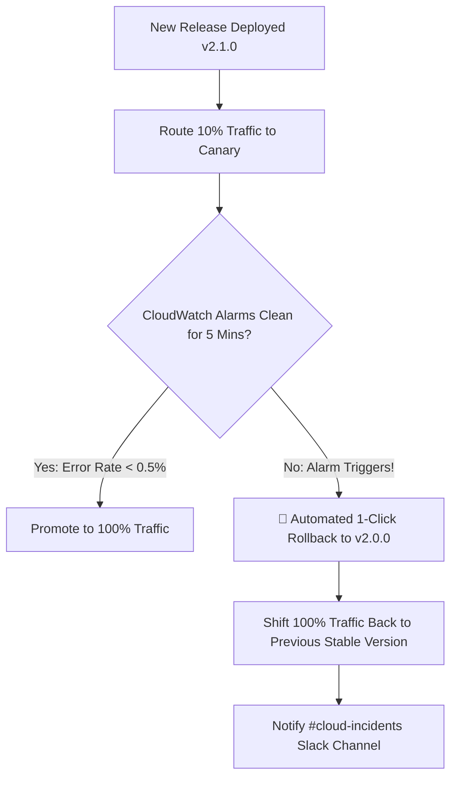
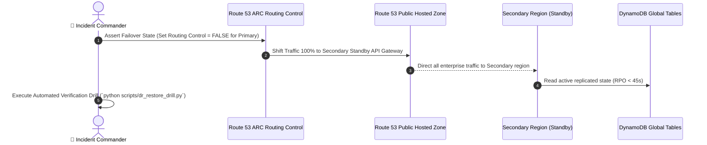

# EnterpriseIQ — Operational Incident Runbooks & Automated Rollback Playbook

**Document Standard:** AWS Well-Architected Framework (Operational Excellence & Reliability Pillars)  
**Target SLAs:** Availability 99.95% | RTO $\le$ 15 min | RPO $\le$ 5 min  
**Classification:** Internal Engineering Confidential  

---

## 📑 Table of Contents
1. [Incident Severity Classification Matrix (P1–P4)](#1-incident-severity-classification-matrix-p1p4)
2. [Canary Deployment & 1-Click Rollback Runbook](#2-canary-deployment--1-click-rollback-runbook)
3. [Disaster Recovery Failover & Restore Drill SOP](#3-disaster-recovery-failover--restore-drill-sop)
4. [Secrets Rotation & Emergency Invalidation Runbook](#4-secrets-rotation--emergency-invalidation-runbook)
5. [FinOps Cost Runaway & Budget Anomaly Response](#5-finops-cost-runaway--budget-anomaly-response)
6. [Blameless Post-Mortem Template](#6-blameless-post-mortem-template)

---

## 1. Incident Severity Classification Matrix (P1–P4)

```
┌──────────┬─────────────────────────────────────────────────┬──────────────┬───────────────────────────────┐
│ Severity │ Definition & Criteria                           │ Response SLA │ Incident Commander            │
├──────────┼─────────────────────────────────────────────────┼──────────────┼───────────────────────────────┤
│ **P1**   │ • Complete outage of AI Query or Workplace Hub  │ < 15 Minutes │ VP of Engineering / On-Call   │
│          │ • Data leakage across department RBAC boundaries│              │ Lead Architect                │
│          │ • Bedrock 5xx error rate > 5% for 3+ minutes    │              │                               │
├──────────┼─────────────────────────────────────────────────┼──────────────┼───────────────────────────────┤
│ **P2**   │ • Document ingestion / Bedrock sync stalled     │ < 45 Minutes │ Senior DevOps / Platform Lead │
│          │ • P95 latency > 10,000ms across all endpoints   │              │                               │
│          │ • S3 staging quarantine approval pipeline down  │              │                               │
├──────────┼─────────────────────────────────────────────────┼──────────────┼───────────────────────────────┤
│ **P3**   │ • Degraded non-critical feature (e.g. feedback) │ < 4 Hours    │ Module Owner Engineer         │
│          │ • Minor UI rendering glitch on edge browsers    │              │                               │
├──────────┼─────────────────────────────────────────────────┼──────────────┼───────────────────────────────┤
│ **P4**   │ • Documentation inaccuracy or styling cosmetic  │ < 24 Hours   │ Documentation Team            │
└──────────┴─────────────────────────────────────────────────┴──────────────┴───────────────────────────────┘
```

---

## 2. Canary Deployment & 1-Click Rollback Runbook

EnterpriseIQ deploys Lambda functions using weighted traffic routing (`Linear10PercentEvery1Minute` or `Canary10Percent5Minutes`).



### Emergency 1-Click Rollback Commands:

```bash
# Option A: Instant Lambda Alias Traffic Reset
aws lambda update-alias \
  --function-name EnterpriseIQ-Query-prod \
  --name live \
  --function-version 4 \
  --routing-config '{"AdditionalVersionWeights": {}}'

# Option B: CloudFormation Stack Rollback
aws cloudformation rollback-stack \
  --stack-name EnterpriseIQ-Backend-prod

# Option C: Revert to previous Git Release via GitHub Actions
gh workflow run deploy.yml -f target_env=prod -r v2.0.0
```

---

## 3. Disaster Recovery Failover & Restore Drill SOP

### 3.1 Scenario: Primary Region Outage (`us-east-1` / `ap-south-1`)



### 3.2 Step-by-Step Failover Execution:

1. **Verify Outage in AWS Health Dashboard / CloudWatch:**
   ```bash
   aws route53 get-health-check-status --health-check-id <PrimaryHealthCheckId>
   ```
2. **Flip Route 53 ARC Routing Control:**
   ```bash
   aws route53-recovery-control-config update-routing-control-states \
     --routing-control-states-entries "[{\"RoutingControlArn\":\"<PrimaryControlArn>\",\"RoutingControlState\":\"Off\"},{\"RoutingControlArn\":\"<SecondaryControlArn>\",\"RoutingControlState\":\"On\"}]"
   ```
3. **Execute Verification Drill:**
   ```bash
   python scripts/dr_restore_drill.py
   ```
4. **Initiate DynamoDB Point-in-Time Recovery (PITR) if Data Corruption Occurred:**
   ```bash
   aws dynamodb restore-table-to-point-in-time \
     --source-table-name EnterpriseIQ-Core-State-prod \
     --target-table-name EnterpriseIQ-Core-State-Restored \
     --restore-date-time 2026-10-08T16:45:00Z
   ```

---

## 4. Secrets Rotation & Emergency Invalidation Runbook

### 4.1 Rotate API Keys in AWS Secrets Manager:
```bash
# 1. Update secret with new credentials
aws secretsmanager put-secret-value \
  --secret-id enterpriseiq/api-tokens \
  --secret-string '{"api_key":"new-prod-token-2026-v2"}'

# 2. Flush Lambda in-memory TTL caches by recycling execution environments
aws lambda update-function-configuration \
  --function-name EnterpriseIQ-Query-prod \
  --environment "Variables={CACHE_BUSTER=$(date +%s)}"
```

### 4.2 Emergency Invalidation of Compromised Token:
1. Immediately delete or rotate the secret in AWS Secrets Manager.
2. Invalidate all active Cognito user sessions:
   ```bash
   aws cognito-idp admin-user-global-sign-out \
     --user-pool-id us-east-1_NexoraUserPool \
     --username <compromised_employee_id>
   ```

---

## 5. FinOps Cost Runaway & Budget Anomaly Response

### 5.1 Trigger: CloudWatch Budget Alarm ($10.00 / ₹5,000 Alert)
1. **Identify High-Cost Consumer:**
   * Run CloudWatch Logs Insights query across `/aws/lambda/EnterpriseIQ-Query-prod`:
     ```sql
     fields @timestamp, departmentScope, actorEmail, tokenCount
     | sort tokenCount desc
     | limit 50
     ```
2. **Apply Model Fallback (Claude 3.5 Sonnet $\rightarrow$ Claude 3 Haiku):**
   ```bash
   aws ssm put-parameter \
     --name "/enterpriseiq/bedrock/primary_model" \
     --value "anthropic.claude-3-haiku-20240307-v1:0" \
     --type "String" \
     --overwrite
   ```
3. **Temporarily Lower Output Token Limit:**
   * Update `MAX_GENERATION_TOKENS` from `768` to `384` to instantly halve token generation burn rate.

---

## 6. Blameless Post-Mortem Template

```markdown
# Incident Post-Mortem: [INC-2026-XXXX] - [Brief Summary]

**Date:** YYYY-MM-DD  
**Incident Commander:** [Name]  
**Severity:** [P1 / P2 / P3]  
**Impact:** [E.g., 120 employees experienced 504 errors for 14 minutes]  
**Measured RTO:** XX minutes (SLA: <= 15 min)  
**Measured RPO:** XX seconds (SLA: <= 5 min)  

### 1. Root Cause
[Detailed explanation of what triggered the failure]

### 2. Timeline of Events
- **14:02 UTC** - Anomaly detected by CloudWatch Alarm.
- **14:06 UTC** - Incident Commander initiated on-call triage.
- **14:12 UTC** - Canary rollback triggered via AWS CLI.
- **14:16 UTC** - Error rate returned to 0.00%.

### 3. Action Items to Prevent Recurrence
| Task | Assignee | Due Date | Status |
|---|---|---|---|
| Add automated canary rollback alarm in CloudFormation | DevOps Team | YYYY-MM-DD | Open |
| Tighten SSM Parameter Store cache TTL to 120s | Backend Team | YYYY-MM-DD | Open |
```
